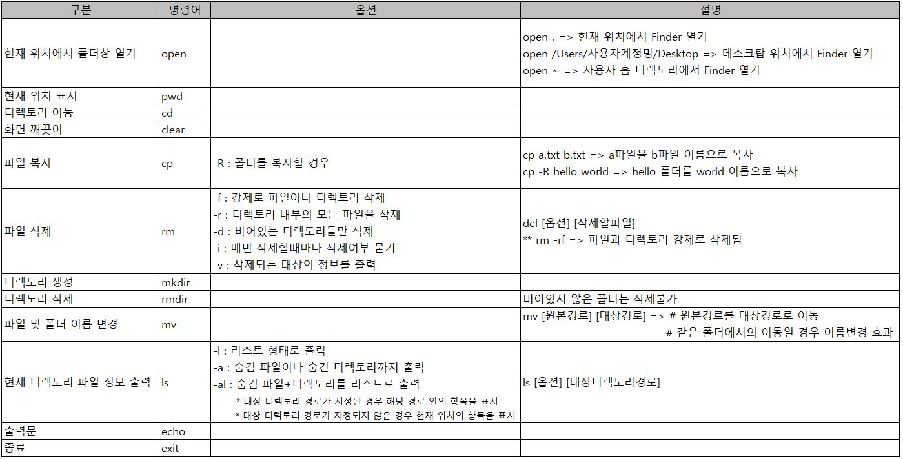

# 컴퓨터 기본

## #01. 개발자 환경 구축

### 1. 운영체제 개요
하드웨어와 소프트웨어를 관리하여 동작이 가능하게 하는 프로그램
- Windows, Linux, MacOS 등

**운영제체 동작**
1. 서버(Server)
   - 접속을 당하는 주체
   - 클라이언트에게 **서비스를 제공**
   - 네트워크를 통해 요청되는 서비스를 제공하는 역할을 하는 컴퓨터
2. 클라이언트(Client)
   - 접속을 하는 주체
   - 서버에게 **서비스를 요청**
   - 네트워크를 통해서 서비스를 요청하는 역할을 하는 컴퓨터  
### 2. 가상머신
- 현재 사용중인 컴퓨터에 가상머신을 설치하여 가상의 컴퓨터 하드웨어를 생성할 수 있음
- 물리적인 컴퓨터가 여러대 구성될 수 없는 경우 사용

**가상화 소프트웨어**  
&nbsp; **VMWare > VirtualBox**  
&nbsp; 예시) 블루스택 : 컴퓨터에 안드로이드를 사용할 수 있게 해주는 소프트웨어  
&nbsp; '가상화 = 클라우드' : 클라우드 최고는 AWS(AWS를 간접체험 하는 것이 VMWare)

### 4. 확장자
|구분|확장자|
|---|---|
|이미지|jpg, jpeg, png, gif, tiff, bmp, svg, psd|
|음성/동영상|wav, mp3, wma / avi, wmv, mkv, au, mov|
|문서|docx, doc, pptx, ppt, xlsx, xls, html, hwp, pdf, txt|
|실행파일|exe, bat, dll|
|압축파일|zip, ***7z***, 7zip, rar, tar, gz, tar.gz, jar|
|가상CD|***iso***, ***dmg***|
|설치파일|***msi***, ***pkg***|

* **7z**는 윈도우에서 맥으로 압축을 풀때 파일명이 깨짐(반대도 마찬가지)
* **iso**는 공통, **dmg**는 맥 전용(가상CD 파일을 보려면 다른곳으로 복사후 보기)
* **msi**는 윈도우 설치파일, **pkg**는 맥 설치파일

    ### 4-1. 디렉토리 표시
    |구분|표시|
    |---|---|
    |root 디렉토리|C:\ &nbsp; &nbsp; /|
    |현재 작업 디렉토리|.|
    |상위 디렉토리|..|
    |홈 디렉토리|~|
    ### 4-2. 절대경로와 상대경로
    **절대경로**  
    &nbsp; 최초의 시작점으로 경유한 경로를 전부 기입하는 방식  
    &nbsp; **- 윈도우 -**  
    &nbsp; &nbsp; C:\Users\UserID\Desktop\test.txt  
    &nbsp; **- Mac -**  
    &nbsp; &nbsp; /Users/UserID/Desktop/test.txt  
  &nbsp; &nbsp; (MacOS는 C:\, D:\ 등 드라이브 문자열의 개념이 없어 '/'로 시작)  

    **상대경로**  
    &nbsp; 현재 위치하고 있는 폴더를 기준으로 위치를 설명  
    &nbsp; **- 현재 폴더 -**  
    &nbsp; &nbsp; './'를 앞에 붙임(생략 가능)  
    &nbsp; &nbsp; ( ./폴더이름/파일이름 )  
    &nbsp; **- 상위 폴더 -**  
    &nbsp; &nbsp; '../'를 앞에 붙임(생략 불가)  
    &nbsp; &nbsp; ( ../폴더이름/파일이름 )

### 5. 터미널 명령어
#### Window  

#### MacOs  

---

## #02. 개발환경지원 (Git)
버전 관리와 협업을 위한 코드 호스팅 플랫폼
### 1. Git을 사용하는데 필요한 프로그램 설치

#### 1) 윈도우의 경우
- GitSCM 설치
#### 2) MacOS의 경우
- 터미널 실행
- Command Line Tool 설치
  - `xcode-select --install`
### 2. Git 사용자 설정 및 한글에 대한 옵션 지정(공통)
- `git config --global user.name "내이름"`
- `git config --global user.email 내이메일`
- `git config --global core.precomposeunicode true`
- `git config --global core.quotepath false`

### 3. SSH-Key를 Git에 등록
- 인증서 등록  
    `ssh-keygen`
- 기존키가 있을경우 덮어쓰기(Y)
- 비밀번호란 그냥 enter
- Key 생성 완료  
  
- 인증서 파일 경로 접근
  - 윈도우 : C:/Users/사용자이름/.ssh
  - 맥 : `open ~/.ssh`
- id_rsa.pub 파일 내용 복사(id_rsa는 개인키)
- Github 로그인 후 Settins
- SSH and GPG Keys
- SSH keys에 복사한 내용 붙여넣기

### 4. 저장소 생성
1. Git 페이지 우측 + 버튼 하위에 위치한 New Repository
2. 프로젝트 이름, 설명, Public/Private 설정, README 체크

### 5. 저장소 클론
1. 내 저장소 code버튼 클릭 후 SSH주소 복사(git@github.com:사용자아이디/프로젝트이름.git)
2. 터미널 홈 디렉토리위치에 주소 붙여넣기(윈도우는 우클릭)

### 6. Git 명령어
- 업로드 대기(커밋)
  - `git add --all`
  - `git commit -m "작업내용에 대한 간략한 코멘트"`
  - 위 두개는 세트이므로 커밋할 경우 두개 모두 입력
- 커밋 내역 저장소에 업로드
  - `git push origin main`
- 저장소의 내용 내려받기
  - `git pull origin main`
---

#### * MEMO *  
- 터미널 "already exits" : "이미 존재" 라는 의미
- .gitignore : Git파일로 업로드 하고 싶지 않은 파일을 적으면 업로드 안됨
- 윈도우 **"바이오스(BIOS)"** 는 여러 하드웨어가 있을 경우 부팅순서를 바꿔주는 것