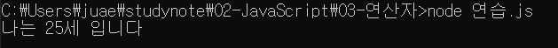
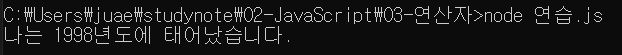
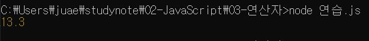

# 한주애 연산자과제

> 2022-01-25

## 문제1

현재 년도에 대한 값을 `year`라는 상수로 생성하고 이 값을 활용하여 자신의 나이를 연산한 후 `age`라는 이름의 지역변수에 할당하고 "나는 00세 입니다." 라는 형식의 문장으로 이스케이프 문자를 활용하여 출려하시오.

**<실습>**
```javascript
const year = 2022;
let age = year-1998;
age++;
console.log("나는 %d세 입니다",age);
```


**<풀이>**
```javascript
const year = 2022;  // 현재 년도
let age = year - 1998 + 1;   // 나이

console.log("나는 %d세 입니다.",age);
```

---

## 문제2

자신의 나이를 의미하는 상수 `age`를 정의하고 이 값을 활용하여 자신이 태어난 년도 `year`를 전역 변수 형식으로 산출하여 "나는 0000년도에 태어났습니다."라는 형식의 문장으로 이스케이프 문자를 활용하여 출력하시오.

**<실습>**
```javascript
const age=25;
var year=2022-age;
year++;
console.log("나는 %d년도에 태어났습니다.",year);
```


**<풀이>**
```javascript
const age = 25;
var year = 2022 - (25-1);   // 2022 - 24 = 1998

console.log("나는 %d년도에 태어났습니다.",year);
```

---
## 문제3.

사과를 바구니에 나누어 담으려고 한다. 하나의 바구니는 사과를 10개씩 담을 수 있으며 사과를 담다가 10개 미만으로 남는 경우 하나의 바구니를 추가로 사용해야 한다. 예를 들어 120개의 사과를 나누어 담기 위해서는 12개의 바구니가 필요하지만 121~130개까지 사과가 있다면 13개의 바구니가 필요하고 다시 131개의 사과를 나누어 담기 위해서는 14개의 바구니가 필요하게 된다.

현재 갖고 있는 사과의 수를 의미하는 `numOfApples` 변수에 123이라는 값이 할당되어 있을 경우 필요한 바구니의 수를 구하는 프로그램을 구현하시오.

**<실습>**
```javascript
const numOfApples = 123;
const bucketSize = 10;
const numBucket = numOfApples/bucketSize+(numOfApples%bucketSize>0 ? 1 : 0);
console.log(numBucket);
```


**<풀이>**
```javascript
/* 
123 / 10 = 12.3
12.3 - 0.3 =12
12 + 1 = 13
*/
 const numOfApples = 123;    // 현재 갖고 있는 사과
// 123을 10으로 나누면 12.3이므로 0.3을 구해야 함
const decimal = (123 % 10) / 10;    // 나머지3 / 10 = 0.3

let basketCount = (123 / 10) - decimal; // 12.3 - 0.3 = 12
basketCount += decimal > 0 ? 1 : 0;
console.log(basketCount);
```

---
## 문제4.

어떤 계산기는 입력된 값에서 백의자리 이하를 버리고 결과를 도출한다고 한다. 예를 들어 입력된 값이 457이라면 400이 결과로 출력된다. 이러한 출력결과를 만들 수 있는 코드를 작성하시오.

**<실습>**
```javascript
// 못함
```

**<풀이>**
```javascript
/*
457 / 100 = 4.57
4.57 - 0.57 = 4
4 * 100 = 400
*/
const num = 457;
const decimal = (num % 100) / 100;  // 나머지57 / 100 = 0.57
const result = ((457 / 100) - decimal) * 100;
console.log(result);
```