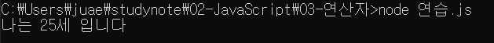
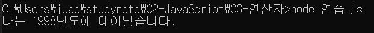

# 한주애 연산자과제

> 2022-01-25

## 문제1

현재 년도에 대한 값을 `year`라는 상수로 생성하고 이 값을 활용하여 자신의 나이를 연산한 후 `age`라는 이름의 지역변수에 할당하고 "나는 00세 입니다." 라는 형식의 문장으로 이스케이프 문자를 활용하여 출려하시오.

```javascript
const year = 2022;
let age = 1998;
age=year-age;
age++;
console.log("나는 %d세 입니다",age);
```


## 문제2

자신의 나이를 의미하는 상수 `age`를 정의하고 이 값을 활용하여 자신이 태어난 년도 `year`를 전역 변수 형식으로 산출하여 "나는 0000년도에 태어났습니다."라는 형식의 문장으로 이스케이프 문자를 활용하여 출력하시오.

```javascript
const age=25;
var year=2022-age;
year++;
console.log("나는 %d년도에 태어났습니다.",year);
```
