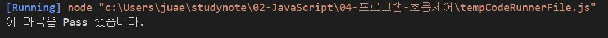
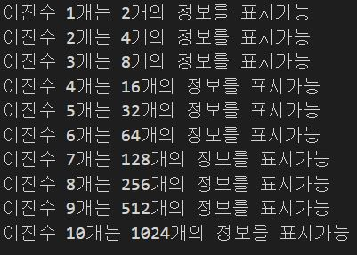

# 프로그램 흐름제어 연습문제

## 문제1

아래의 `switch문`을 `if문`으로 재각성 하시오.

```javascript
const 수학 = "B";

switch (수학) {
    case 'A' :
    case 'B' :
    case 'C' :
        console.log("이 과목을 Pass 했습니다.");
        break;
    default :
        console.log("이 과목을 Pass하지 못했습니다.");
        break;
}
```
```javascript
const 수학 = "B";

if (수학 == "A" || 수학 == "B" || 수학 == "C") {
    console.log("이 과목을 Pass 했습니다.");
}else {
    console.log("이 과목을 Pass하지 못했습니다.");
}
```



## 문제2
한 개의 2진수는 `0`과 `1` 두 개의 정보를 표시할 수 있고, 두 개의 이진수는 `00`, `01`, `10`, `11`과 같이 총 네 개의 정보를 표시할 수 있다. 이처럼 이진수가 하나 늘어날 때마다 2배씨 표현할 수 있는 정보의 수가 늘어날 때 10개의 이진수는 총 몇개의 정보를 표현할 수 있는지를 while문으로 구현하시오.

### 출력예시
```javascript
이진수 1개는 2개의 정보를 표시가능
이진수 2개는 4개의 정보를 표시가능
이진수 3개는 8개의 정보를 표시가능
이진수 4개는 16개의 정보를 표시가능
이진수 5개는 32개의 정보를 표시가능
이진수 6개는 64개의 정보를 표시가능
이진수 7개는 128개의 정보를 표시가능
이진수 8개는 256개의 정보를 표시가능
이진수 9개는 512개의 정보를 표시가능
이진수 10개는 1024개의 정보를 표시가능
```

```javascript
let i=1;    // 이진수 개수
let j=1;    // 진수의 정보 개수(누적된 곱셈에 대한 초기값은 1부터 시작.)

while(i<=10){
    j*=2;
    console.log("이진수 %d개는 %d개의 정보를 표시가능",i,j);
    i++;
}
```


## 문제3
위 2번 문제를 for문으로 다시 표현하시오.
```javascript
let j=1;

for(let i=1; i<=10; i++){
    j*=2;
    console.log("이진수 %d개는 %d개의 정보를 표시가능",i,j);
}
```
