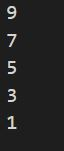
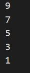
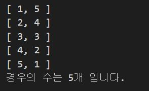
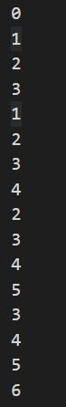
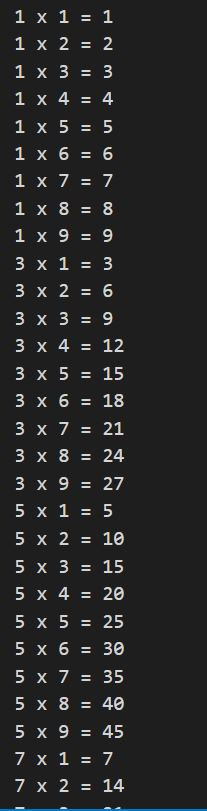
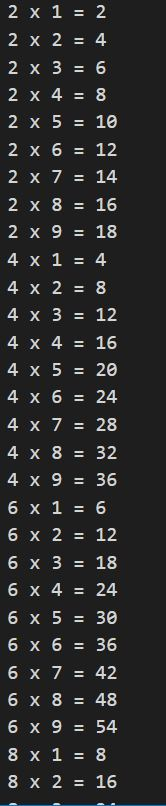

# 기본문법 활용하기 연습문제

## 문제 1.

for문을 사용하여 0부터 10미만의 정수 중에서 홀수만을 큰수부터 출력하시오.
```javascript
for(i=9; i>=0; i--){
    if(i % 2 == 1){
        console.log(i);
    }
}
```

### 풀이
```javascript
for(let i=9; i>-1; i-=2){
    console.log(i);
}
```


## 문제 2.

while문을 사용하여 0 부터 10 미만의 정수 중에서 홀수만을 큰수부터 출력하시오.
```javascript
let i=9;
while(i>=0){
    if(i%2==1){
        console.log(i);
    }
    i--;
}
```
### 풀이
```javascript
let i=9;
while(i>-1){
    i-=2;
    console.log(i);
}
```


## 문제 3.

1부터 20 미만의 정수 중에서 2 또는 3의 배수인 수의 총합을 구하시오.
```javascript
const x = 2;
const y = 3;
let sum = 0;  // 총합

for(let i=1; i<20; i++){
    if(i%x==0 && i%y==0){
        sum+=i;
    }
}
console.log("총합: "+sum);
```
### 풀이
```javascript
let sum = 0;  // 총합

for(let i=1; i<20; i++){
    if(i%2==0 && i%3==0){
        sum+=i;
    }
}
console.log("총합: "+sum);
```


## 문제 4.

두 개의 주사위를 던졌을 때, 눈의 합이 6이 되는 모든 경우의 수를 출력하고 경우의 수는 총 몇가지 인지를 아래와 같이 출력하는 코드를 작성하시오.

```
[ 1, 5 ]
[ 2, 4 ]
[ 3, 3 ]
[ 4, 2 ]
[ 5, 1 ]
경우의 수는 5개 입니다.
```
```javascript
let sum = 0;

for(let x=1; x<7; x++){
    for(let y=1; y<7; y++){
        if (x+y == 6){
            console.log("[ %d, %d ]",x,y);
            sum++;
        }
    }
}
console.log("경우의 수는 %d개 입니다.",sum);
```


## 문제 5.

for문을 중첩하여 실행하여 아래와 같은 출력 결과를 만드시오.

```
0 1 2 3 
1 2 3 4 
2 3 4 5 
3 4 5 6 
```

```javascript
for(let i=0; i<4; i++){
    for(let j=0; j<4; j++){
        let n=0;
        n=i+j;
        console.log(n);
    }  
}
```
### 풀이
```javascript
for(let i=0; i<4; i++){
    // 한 줄에 출력할 문자열 변수
    let str="";

    for(let j=0; j<4; j++){
        str+=i+j;

        // 마지막회차 제거
        if(j+1<4){
            str+=" ";
        }
    }
    console.log(str);
}
```


## 문제 6.

아래와 같은 출력 결과가 나타나도록 중첩 반복문을 for 문 형식으로 구현하시오.

```
1
12
123
1234
12345
123456
1234567
```

```javascript
못함
```
### 풀이
```javascript
for(let i=0; i<7; i++){
    let str="";
    for(let j=0; j<i+1; j++){
        str += j+1;
    }
    console.log(str);
}
```

## 문제 7.

number라는 변수를 정의하고 1 혹은 2의 값을 임의로 할당하시오. 이 변수에는 1이나 2밖에 저장될 수 없습니다.

구구단 프로그램을 만들고자 한다.

전체를 출력하는 구구단이 아니라 number가 1일 때는 홀수 단(3, 5, 7, 9), number가 2일 때는 입력하면 짝수 단(2, 4, 6, 8)을 출력하는 프로그램을 완성하시오.

```javascript
// const number = 1;
const number = 2;

if(number==1){
    for(let i=1; i<10; i++){
        for(let j=1; j<10; j++){
            if(i%2==1){
                console.log("%d x %d = %d",i,j,i*j);
            }
        }
    }
    
}else if(number == 2){
    for(let i=1; i<10; i++){
        for(let j=1; j<10; j++){
            if(i%2==0){
                console.log("%d x %d = %d",i,j,i*j);
            }
        }
    }
}
```
### 풀이
```javascript
const number = 2;

for(let i=2; i<10; i++){
    if(number==1){
        if(i%2!=0){
            for(let j=1; j<10; j++){
                console.log("%d x %d = %d",i,j,i*j);
            }
        }
    }else{
        if(i%2==0){
            for(let j=1; j<10; j++){
                console.log("%d x %d = %d",i,j,i*j);
            }
        }
    }
}
///////////////////////////////////////////////////////////

const number = 1;       // 3, 5, 7, 9
// const number = 2;    // 2, 4, 6, 8

let start = null;

let start = number == 2 ? 2 : 3;

for(let i=start; i<10; i+=2){
    for(let j=1; j<10; j++){
        console.log("%d x %d = %d", i,j,i*j)
    }

}
///////////////////////////////////////////////////////////

const number = 2;
//const number = 1;

for(let i=4-number; i<10; i+=2){
    for(let j=1; j<10; j++){
        console.log("%d x %d = %d",i,j,i*j);
    }
}
```



### 추가문제
```javascript
// x가 1일때 0출력, x가 0일때 1출력
let x =1;
//let x= 0;

if(x ==1){
    x=0;
}else {
    x=1;
}
---------------------------
x=x==1 ? 0: 1;
---------------------------
x=1-x

console.log(x); --> 0,1
```