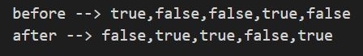
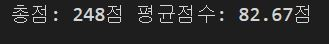
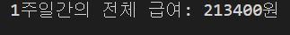
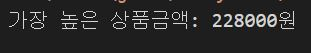
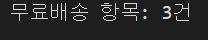
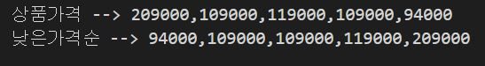
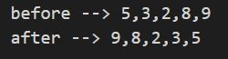
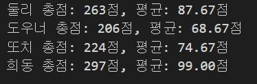
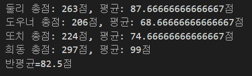
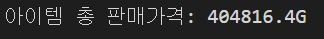

# 프로그램 흐름제어 연습문제

## 문제1

다음의 소스코드는 boolean 데이터를 저장하고 있는 배열에 대한 어떤 처리를 보여준다.
실행 결과에서 제시하는 것과 같이 배열에 저장되어 있는 값들을 반전(true는 false로, false는 true로) 변환하는 처리를 완성하시오.
```javascript
var check_list = [true, false, false, true, false];
console.log("before --> "+check_list);

for(let i=0; i<check_list.length; i++){
    if(check_list[i]==true){
        check_list[i] = false;
    }else{
        check_list[i]= true;
    }
}

console.log("after --> " + check_list);
```
#### 풀이
```javascript
const check_list = [true,false,false,true,false];
console.log("before --> "+check_list);
for(let i=0; i<check_list.length; i++){
    check_list[i]=!check_list[i];
}

console.log("after --> " + check_list);
```



## 문제2
다음 표는 어떤 학생의 과목별 점수이다.
||HTML|CSS|Javascript|
|---|---|---|---|
|점수|75|82|91|

이 학생의 총점과 평균점수를 구하는 프로그램에 대한 아래의 소스코드를 완성하시오.

```javascript
var grade = [75,82,91];
var sum = 0, avg = 0;

for(let i=0; i<grade.length; i++){
    sum+=grade[i];
}
avg = sum/grade.length

avg = avg.toFixed(2);
console.log("총점: "+sum+"점", "평균점수: "+avg+"점");
```
#### 풀이
```js
const grade = [75, 82, 91];
let sum =0, avg = 0;

// 총점 1번
/*
for(let i=0; i<grade.length; i++){
    sum += grade[i];
}
*/

// 총점 2번
for(const p of grade){
    sum += p;
}

// 평균
avg = sum / grade.length;

avg = avg.toFixed(2);
console.log("총점: " + sum + "점, 평균점수: " + avg + "점");
```



## 문제3
다음 표는 어떤 학생이 일요일부터 토요일까지의 일주일간 아르바이트를 한 시간이다.
|일|월|화|수|목|금|토|
|---|---|---|---|---|---|---|
|7|5|5|5|5|10|7|

주말에는 7시간, 평일에는 5시간을 일하기로 했지만, 금요일에 다른 직원의 사정으로 대신 근무를 하게 되어 10시간을 일했다.
이 학생의 시급이 4,500이었지만 목요일부터는 5,200원으로 올랐다고 할 때 일주일간의 총 급여를 구하는 프로그램을 작성하시오. (기본 코드는 아래 제시되는 내용을 사용하세요.)

```javascript
var time = [7,5,5,5,5,10,7];
var money = 0;

for(let i=0; i<time.length; i++){
    if(i>3){
        money+=time[i]*5200;
    }else{
        money+=time[i]*4500;
    }
}

console.log("1주일간의 전체 급여: "+money+"원");
```
#### 풀이
```javascript
const time = [7,5,5,5,5,10,7];
let money = 0;

for(let i=0; i<time.length; i++>){
    // 풀이1
    let x =0;
    if(i<4){
        x=4500;
    }else{
        x=5200;
    }
    money += time[i]*x;

    // 풀이2
    let x=(i<4) ? 4500:5200;
    money+=time[i]*x;

    //풀이3
    money+=time[i]*(i<4) ? 4500:5200;
}
console.log("1주일간의 전체 급여: "+money+"원");
```



## 문제4
상품의 가격을 원소로 갖는 1차 배열 price와 각 상품의 수량을 원소로 갖는 1차 배열 qty를 다음과 같이 정의하였을 때 이 사람이 총 얼마를 결제해야 하는지 총 결제금액을 구하는 프로그램을 작성하시오.
|상품1|상품2|상품3|상품4|
|---|---|---|---|
|38000*6|20000*4|17900*3|17900*5|

#### 풀이
```javascript
var price = [38000,20000,17900,17900];
var qty = [6,4,3,5];
var money = 0;

for(let i=0; i<price.length; i++){
    money+= price[i]*qty[i];
}

console.log("전체 결재 금액: "+money+"원");
```


## 문제5
문제 4번의 장바구니 내역에서 상품금액(판매가*수량)이 가장 비싼 항목은 얼마인지 출력하시오.
```javascript
const price = [38000,20000,17900,17900];
const qty = [6,4,3,5];
let max = new Array(4);
let data;

for(let i=0; i<price.length; i++){
    max[i]=price[i]*qty[i];
    
    data=max[0];
    
    if(data < max){
        data = max;
    }
}
console.log("가장 높은 상품금액: "+data+"원");
```
#### 풀이
``` js
const price = [38000, 20000, 17900, 17900];
const qty = [6,4,3,5];

let money = price[0] * qty[0];

for(let i=1; i<price.length; i++){
    const sum = price[i] * qty[i];

    if(money < sum){
        money = sum;
    }
}
console.log("가장 높은 상품금액: " + money + "원");
```


## 문제6
문제4번의 장바구니 내역에서는 모든 장바구니 상품이 개별 배송이라고 한다. 상품금액(판매가*수량)이 8만원 이상인 경우 무료로 배송이 된다고 할 때 무료로 배송되는 항목은 모두 몇 개 인지 구하는 프로그램을 구현하시오.
```javascript
const price = [38000,20000,17900,17900];
const qty = [6,4,3,5];
let deli = 0;

for(let i=0; i<price.length; i++){
    let money=price[i]*qty[i];
    
    if(money>=80000){
        deli++;
    }
}
console.log("무료배송 항목: "+deli+"건");
```


## 문제7
다음은 어느 쇼핑몰의 상품 목록 화면이다.


아래의 소스코드는 위의 상품 목록에서 상품의 가격을 원소로 하는 배열 money를 정의하였을 때 “낮은 가격순”버튼이 눌러졌을 때 상품의 가격을 재정렬하기 위한 코드에 대한 일부이다. 빈 칸을 채워넣어 완성하시오.
```javascript
const price = [209000, 109000, 119000, 109000, 94000];
console.log("상품가격 --> "+price);

for(let i=0; i<price.length-1; i++){
    for(let j=i+1; j<price.length; j++){
        if(price[i]>price[j]){
            const tmp = price[i];
            price[i]=price[j];
            price[j]=tmp;
        }
    }
}
console.log("낮은가격순 --> "+price);
```


## 문제8
아래의 코드는 배열의 원소를 반대로 배치하는 소스코드의 일부이다.
빈 칸을 완성하시오. (번호가 같은 박스는 같은 코드가 들어갑니다.)
```javascript
//시간부족
```
#### 풀이
```javascript
const arr = [5, 3, 2, 8, 9];
console.log("before --> "+arr);

for(let i=0; i<arr.length/2; i++){
    const tmp = arr[i];
    arr[i] = arr[arr.length-1-i];
    arr[arr.length-1-i] = tmp;
}

console.log("after --> "+arr);
```


## 문제9
다음 표는 어느 학급의 성적표이다. HTML
||HTML|CSS|Javascript|
|---|---|---|---|
|둘리|78|89|96|
|도우너|62|77|67|
|또치|54|90|80|
|희동|100|99|98|

학생별 총점과 평균점수를 구하기 위한 소스코드를 아래와 같이 작성중이다. 빈 칸을 완성하시오.
단, 평균점수의 경우 toFixed() 함수를 사용하여 소수점 둘째 자리까지만 출력하시오.
```javascript
const student = ['둘리','도우너','또치','희동'];

const grade = [
    [78,89,96],
    [62,77,67],
    [54,90,80],
    [100,99,98],
];

let sum=0, avg=0;

for(let i=0; i<grade.length; i++){
    sum=0;

    for(let j=0; j<grade[i].length; j++){
        sum+=grade[i][j];
    }

    avg = sum/grade[i].length;
    avg = avg.toFixed(2);

    console.log(student[i]+ " 총점: "+sum+"점, 평균: "+avg+"점");
}
```


## 문제10
위의 문제에서 반 평균을 출력하시오. 반 평균은 학생의 평균점수 총 합/학생수로 구합니다.
[주의] toFixed() 함수로 가공된 값은 문자열 형태이기 때문에 숫자 연산이 불가능합니다. 이를 감안하여 반 점수를 구하세요.
```javascript
const student = ['둘리','도우너','또치','희동'];

const grade = [
    [78,89,96],
    [62,77,67],
    [54,90,80],
    [100,99,98],
];

let sum=0, avg=0;
let avgSum = 0;

for(let i=0; i<grade.length; i++){
    sum=0;

    for(let j=0; j<grade[i].length; j++){
        sum+=grade[i][j];
    }

    avg = sum/grade[i].length;
    
    avgSum +=avg;
    total = avgSum/student.length;

    console.log(student[i]+ " 총점: "+sum+"점, 평균: "+avg+"점");
}
console.log("반평균="+total+"점");
```
#### 풀이
```js
const student = ['둘리', '도우너', '또치', '희동'];
const grade = [
    [78,89,96],
    [62,77,67],
    [54,90,80],
    [100,99,98],
];

let sum=0, avg=0;
var class_sum = 0;
var clss_avg = 0;

for(let i=0; i<grade.length; i++){
    sum = 0;

    for(let j=0; j<grade[i].length; j++){
        sum += grade[i][j];
    }

    avg = sum / grade[i].length

    class_sum += avg;
    avg = avg.toFixed(2);
    
    console.log(student[i] + "총점: " + sum + "점, 평균: "+ avg + "점");
}

class_avg = class_sum/student.length;
class_avg.toFixed(2);
console.log("반평균= "+class_avg +"점");
```


## 문제11
아래는 어느 게임 유저의 아이템 인벤토리이다.

첫 줄에 있는 아이템을 판매한다고 할 때 이 유저가 벌어들이는 골드(G)의 총액은 얼마인가? (판매를 위해 선택한 아이템의 상단에는 1개당 가격이 표시되고, 아이템을 판매할 때는 원래 가격의 90%만 받을 수 있다고 한다.)
- 가격과 아이템 수량의 정보를 2차 배열로 구성하는 소스코드를 완성하세요. ("단가-수량"을 한 세트로 하는 정보들을 배열로 구성하면 2차 배열 형태가 됩니다.)
```javascript
const item = [
    [500,291],
    [320,586],
    [100,460],
    [120,558],
    [92,18],
    [30,72],
];
let sum = 0;

for(let i=0; i<item.length; i++){
    sum+=(item[i][0]*item[i][1])*0.9;
}
console.log("아이템 총 판매가격: "+sum+"G");
```
#### 풀이
```js
const inven = [
    [500, 320, 100, 120, 92, 30],
    [291, 586, 460, 558, 18, 72]
];

let total_price = 0;

for(let i=0; i<inven[0].length; i++){
    total_price +=(inven[0][i] * 0.9)*inven[1][i];
}
console.log("아이템 총 판매가격: "+total_price+"G");
```


## 문제12
자신의 주민번호 한 글자씩 모든 숫자를 원소로 갖는 배열 jumin을 아래와 같이 정의하시오.

```js
ssn = [0,1,1,2,1,3,1,0,0,0,1,2,3]
```

정의된 배열을 활용하여 유효한 주민등록번호인지 아닌지를 판별하는 코드를 구현해보자. 판별 방법은 아래와 같다.

- 기본 주민등록코드에는 각 숫자에 대응하는 가중치가 있다. 가중치는 주민등록번호의 순서에 따라 `2 3 4 5 6 7 8 9 2 3 4 5` 이다.
- 먼저 마지막 숫자는 제외하고, 기본코드의 각 12자리와 가중치를 모두 곱하여 합한다.
- 합한 값을 11로 나눈 나머지 값을 구한다.
- 11에서 그 나머지 값을 뺀 후, 이를 10을 나눈 나머지를 구한다.
- 나머지의 1의 자리 값과 주민등록번호 마지막 자리 값이 맞아야 유효한 주민등록번호이다.
```javascript
const jumin = [0,1,1,2,1,3,1,0,0,0,1,2,3];
const num = [2,3,4,5,6,7,8,9,2,3,4,5];

let sum = 0;

for(let i=0; i<jumin.length-1; i++){
    sum += jumin[i]*num[i];
}
let a = sum % 11;
let result = (11-a)%10;
if(jumin[jumin.length-1]==result){
    console.log("유효한 주민번호 입니다.");
}else{
    console.log("유효하지 않는 주민번호 입니다.");
}
```
#### 풀이
```js
ssn = [0, 1, 1, 2, 1, 3, 1, 0, 0, 0, 1, 2, 3];

// 가중치 : 2 3 4 5 6 7 8 9 2 3 4 5
// --> 가중치 변수k
let k=2;

// 마지막 숫자는 제외하고, 기본코드의 각 12자리와 가중치를 모두 곱하여 합한다
let sum=0;

for(let i=0; i<ssn.length-1; i++){
    sum += ssn[i] * k;

    // 다음번 숫자와 곱하기 위해 가중치 1증가
    k++;

    // 가중치 값이 9보다 크면 2로 리셋
    if(k>9){
        k=2;
    }
}

// 합한 값을 11로 나눈 나머지 값을 구한다
let mod = sum%11;

// 11에서 그 나머지 값을 뺀 후, 이를 10으로 나눈 나머지를 구한다.
let x = (11-mod)%10;

// 나머지의 1의 자리 값과 주민등록번호 마지막 자리 값이 맞아야 유효한 주민등록번호이다.
let y = x%10;

if(y==ssn[ssn.length-1]){
    console.log("유효한 주민번호");
}else{
    console.log("유효하지 않은 주민번호");
}
```
