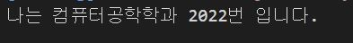
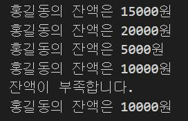

# 한주애Class 기반 객체지향 연습문제
>2022-02-09

## 문제1.

앞 단원에서 수행한 연습문제 1,2번을 Class 기반의 객체지행으로 재구성하시오.

```js
class Student{
    constructor(){
        this.ko = null;
        this.en = null;
        this.math = null;
    }

    sum(){
        return this.ko + this.en + this.math;
    }

    avg(){
        return this.sum() / 3;
    }
}

const grade = [
    ["철수", 92, 81, 77],
    ["영희", 72, 95, 98],
    ["민혁", 80, 86, 84],
];

for(let i=0; i<grade.length; i++){
    const s = new Student();
    
    s.ko = grade[i][1];
    s.en = grade[i][2];
    s.math =grade[i][3];

    console.log("%s의 총점은 %d점 이고, 평균은 %d점 입니다.", grade[i][0], s.sum(), s.avg());
}

```


## 문제2.

앞 단원에서 수행한 연습문제 1,2번을 Class 기반의 객체지행으로 재구성하시오.

```js
class Rectangle{
    constructor(){
        this._width = null;
        this._height = null;
    }

    get width(){
        return this._width;
    }
    set width(w){
        this._width = w;
    }


    get height(){
        return this._height;
    }
    set height(h){
        this._height = h;
    }


    getAround(){
        return (this._width + this._height)*2;
    }

    getArea(){
        return this._width * this._height;
    }
}

const react = new Rectangle();
react.width = 10;
react.height = 5;

console.log("둘레의 길이는 %d이고 넓이는 %d입니다.", react.getAround(), react.getArea());

```

## 문제3
다음을 만족하는 Student 클래스를 작성하시오.

1) String형의 학과와 정수형의 학번을 프로퍼티로로 선언후 생성자를 통해 주입
2) getter, setter를 정의
3) sayHello() 메서드를 통해 "나는 OOOO학과 OO학번 입니다." 를 출력하는 기능을 구현
```js
class Student{
    constructor(deptName, stNo){
        this._dept = deptName;
        this._no = stNo;
    }

    set dept(deptName){
        this._dept = deptName;
    }
    get dept(){
        return this._dept;
    }

    set no(stNo){
        this._no = stNo;
    }
    get no(){
        return this._no;
    }

    sayHello(){
        console.log("나는 %s학과 %d번 입니다.",this.dept, this.no);
    }

}

const st1 = new Student("컴퓨터공학", "2022");

st1.sayHello();
```



## 문제4
다음을 만족하는 클래스 Account를 작성하시오.

1) 다음의 2 개의 필드를 선언
    문자열 owner; (이름)
    숫자형 balance; (금액)
2) 위 모든 필드에 대한 getter와 setter의 구현
3) 위 모든 필드를 사용하는 가능한 모든 생성자의 구현
3) 메소드 deposit()의 헤드는 다음과 같으며 인자인 금액을 저축하는 메소드
    deposit(amount)
4) 메소드 withdraw()의 헤드는 다음과 같으며 인자인 금액을 인출(리턴)하는 메소드
    withdraw(long amount)
    인출 상한 금액은 잔액까지로 하며, 이 경우 이러한 상황을 출력

```js
class Acoount{
    constructor(owner, balance){
        this._owner = owner;
        this._balance = balance;
    }

    set owner(value){
        this._owner = value;
    }
    get owner(){
        return this._owner;
    }


    set balance(value){
        this._balance = value;
    }
    get balance(){
        return this._balance;
    }

    disposit(amount){
        this.balance += amount;
    }

    withdraw(amount){
        if(this.balance < amount){
            console.log("잔액이 부족합니다.");
            return 0;
        }
        this.balance -= amount;
        return amount;
    }

}

const s = new Acoount("홍길동", 15000);
console.log("%s의 잔액은 %d원", s.owner, s.balance);    // 15000원

// 저축
s.disposit(5000);
console.log("%s의 잔액은 %d원", s.owner, s.balance);    // 20000원

// 인출
s.withdraw(15000);
console.log("%s의 잔액은 %d원", s.owner, s.balance);    // 5000원

// 저축
s.disposit(5000);
console.log("%s의 잔액은 %d원", s.owner, s.balance);    // 10000원

// 인출
s.withdraw(15000);
// 잔액부족 출력
console.log("%s의 잔액은 %d원", s.owner, s.balance);    // 10000원

```
