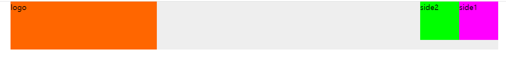

# 한주애 과제
> 2022-03-07

## case 1.
```html
<!DOCTYPE html>
<html lang="ko">
<head>
    <meta charset="UTF-8">
    <title>case1</title>
    <link rel="stylesheet" type="text/css" href="css/common.css" />
    <style>
        .container {
            width: 1000px;
            background-color: #eee;
            margin: auto;
        }
        .logo {
            width: 300px;
            height: 100px;
            background-color: #ff6600;
        }
        .side1 {
            width: 80px;
            height: 80px;
            background-color: #ff00ff;
        }
        .side2 {
            width: 80px;
            height: 80px;
            background-color: #00ff00;
        }
    </style>
</head>
<body>
    <div class="container clearfix">
        <div class="logo pull-left">logo</div>
        <div class="side1 pull-left">side1</div>
        <div class="side2 pull-left">side2</div>
    </div>
</body>
</html>
```


## case 2.
```html
<!DOCTYPE html>
<html lang="ko">
<head>
    <meta charset="UTF-8">
    <title>case1</title>
    <link rel="stylesheet" type="text/css" href="css/common.css" />
    <style>
        .container {
            width: 1000px;
            background-color: #eee;
            margin: auto;
        }
        .logo {
            width: 300px;
            height: 100px;
            background-color: #ff6600;
        }
        .side1 {
            width: 80px;
            height: 80px;
            background-color: #ff00ff;
        }
        .side2 {
            width: 80px;
            height: 80px;
            background-color: #00ff00;
        }
    </style>
</head>
<body>
    <div class="container clearfix">
        <div class="logo pull-left">logo</div>
        <div class="side1 pull-right">side1</div>
        <div class="side2 pull-right">side2</div>
    </div>
</body>
</html>
```


## case 3.
```html
<!DOCTYPE html>
<html lang="ko">
<head>
    <meta charset="UTF-8">
    <title>Document</title>
    <link rel="stylesheet" type="text/css" href="css/common.css" />
    <style>
        .container {
            width: 1000px;
            background-color: #eee;
            margin: auto;
        }
        .logo {
            width: 300px;
            height: 100px;
            background-color: #ff6600;
            /* 절대 좌표 방식 */
            position:absolute;
            /* box의 좌측 상단 꼭지점을 부모 중앙에 맞춤 */
            left:50%;
            top:50%;
            /* 스스로의 반만큼 반대로 이동 */
            margin-left:-150px;
            margin-top:-50px;
        }
        .side1 {
            width: 80px;
            height: 80px;
            background-color: #ff00ff;
        }
        .side2 {
            width: 80px;
            height: 80px;
            background-color: #00ff00;
        }
    </style>
</head>
<body>
    <div class="container clearfix">
        <div class="logo">logo</div>
        <div class="side1 pull-left">side1</div>
        <div class="side2 pull-right">side2</div>
    </div>
</body>
</html>
```


## case4.
```html
<!DOCTYPE html>
<html lang="ko">
<head>
    <meta charset="UTF-8">
    <title>case1</title>
    <link rel="stylesheet" type="text/css" href="css/common.css" />
    <style>
        .container {
            width: 1000px;
            background-color: #eee;
            margin: auto;
            /* .logo의 좌표 기준점 설정 */
            position:relative;
            height:150px;
        }
        .logo {
            width: 300px;
            height: 100px;
            background-color: #ff6600;
            position:absolute;
            left:50%;
            top:50%;
            margin-left:-150px;
            margin-top:-50px;
        }
        .side1 {
            width: 80px;
            height: 80px;
            background-color: #ff00ff;
            position:absolute;
            left:50%;
            top:50%;
            margin-left:-240px;
            margin-top:-40px;
        }
        .side2 {
            width: 80px;
            height: 80px;
            background-color: #00ff00;
            position:absolute;
            left:50%;
            top:50%;
            margin-left:160px;
            margin-top:-40px;
        }
    </style>
</head>
<body>
    <div class="container">
        <div class="logo">logo</div>
        <div class="side1">side1</div>
        <div class="side2">side2</div>
    </div>
</body>
</html>
```
