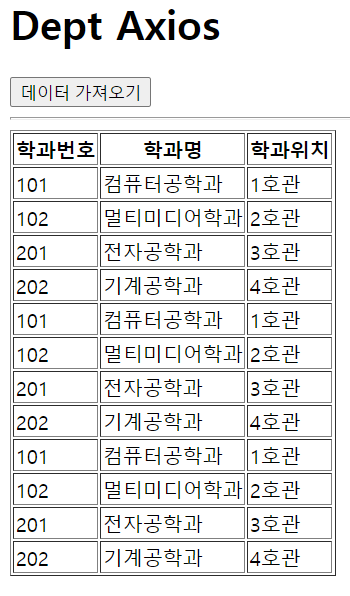
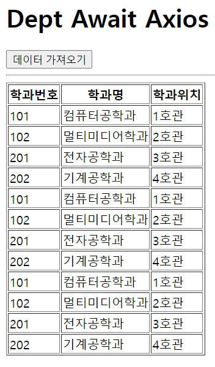

# 한주애 과제
> 2022-04-04

## 문제1
```html
<!DOCTYPE html>
<html lang="ko">
  <head>
    <meta charset="UTF-8" />
    <meta http-equiv="X-UA-Compatible" content="IE=edge" />
    <meta name="viewport" content="width=device-width, initial-scale=1.0" />
    <title>Document</title>
    <style>
      #loading {
        width: 100px;
        height: 100px;
        background-image: url(img/loading.gif);
        background-size: cover;
        background-repeat: no-repeat;
        background-position: center center;
        display: block;
        position: absolute;
        left: 50%;
        top: 50%;
        margin-left: -50px;
        margin-top: -50px;
        z-index: 99999999999;
        display: none;
      }
      #loading.active {
        display: block;
      }
    </style>
  </head>
  <body>
    <div id="loading"></div>
    <h1>Dept Axios</h1>
    <button id="btn" type="button">데이터 가져오기</button>
    <hr />
    <table border="1">
      <thead>
        <tr>
          <th>학과번호</th>
          <th>학과명</th>
          <th>학과위치</th>
        </tr>
      </thead>

      <tbody id="list-body"></tbody>
    </table>
    <script src="https://cdn.jsdelivr.net/npm/axios/dist/axios.min.js"></script>
    <script>
      document.querySelector("#btn").addEventListener("click", (e) => {
        const loading = document.querySelector("#loading");
        loading.classList.add("active");

        const listBody = document.querySelector("#list-body");

        axios
          .get("http://localhost:3000/department")
          .then(({data}) => {
            console.log(data);
            data.map((v, i) => {
                const tr = document.createElement("tr");

                const td1 = document.createElement("td");
                td1.innerHTML = v.id;

                const td2 = document.createElement("td");
                td2.innerHTML = v.dname;

                const td3 = document.createElement("td");
                td3.innerHTML = v.loc;

                tr.appendChild(td1);
                tr.appendChild(td2);
                tr.appendChild(td3);

                listBody.appendChild(tr);
            });
          })
          .catch((error) => {
            console.error(error);
            console.error(error.response.status);
            console.error(error.response.statusText);
            console.error(error.response.data);
            alert(error.response.statusText);
          })
          .finally(() => {
            loading.classList.remove("active");
          });
      });
    </script>
  </body>
</html>
```


## 문제2
```html
<!DOCTYPE html>
<html lang="ko">
<head>
    <meta charset="UTF-8">
    <meta http-equiv="X-UA-Compatible" content="IE=edge">
    <meta name="viewport" content="width=device-width, initial-scale=1.0">
    <title>Document</title>
    <style>
        #loading {
            width:100px;
            height:100px;
            background-image:url(img/loading.gif);
            background-size:cover;
            background-repeat:no-repeat;
            background-position:center center;
            display:block;
            position:absolute;
            left:50%;
            top:50%;
            margin-left:-50px;
            margin-top:-50px;
            z-index:99999999999;
            display:none;
        }
        #loading.active{
            display:block;
        }
        
    </style>
</head>
<body>
    <div id="loading"></div>
    <h1>Dept Await Axios</h1>

    <button id="btn" type="button">데이터 가져오기</button>
    <hr />

    <table border="1">
        <thead>
            <tr>
                <th>학과번호</th>
                <th>학과명</th>
                <th>학과위치</th>
            </tr>
        </thead>
        <tbody id="list-body"></tbody>
    </table>


    <script src="https://cdn.jsdelivr.net/npm/axios/dist/axios.min.js"></script>
    <script>
        document.querySelector('#btn').addEventListener('click', async (e) => {
            const loading = document.querySelector('#loading');
            loading.classList.add('active');

            let json = null;

            try{
                json = await axios.get('http://localhost:3000/department');
                console.log(json);
            }catch(e){
                console.error(e);
                console.error(e.response.status);
                console.error(e.response.statusText);
                console.error(e.response.data);
                alert(e.response.statusText);
            }finally{
                loading.classList.remove('active');
            }

            if(json != null){
                const listBody = document.querySelector('#list-body');
                console.log(json.data);
                
                json.data.map((v,i) => {
                    const tr = document.createElement('tr');

                    const td1 = document.createElement('td');
                    td1.innerHTML = v.id;

                    const td2 = document.createElement('td');
                    td2.innerHTML = v.dname;

                    const td3 = document.createElement('td');
                    td3.innerHTML = v.loc;

                    tr.appendChild(td1);
                    tr.appendChild(td2);
                    tr.appendChild(td3);

                    listBody.appendChild(tr);
                })
            }
        });
    </script>
</body>
</html>
```
