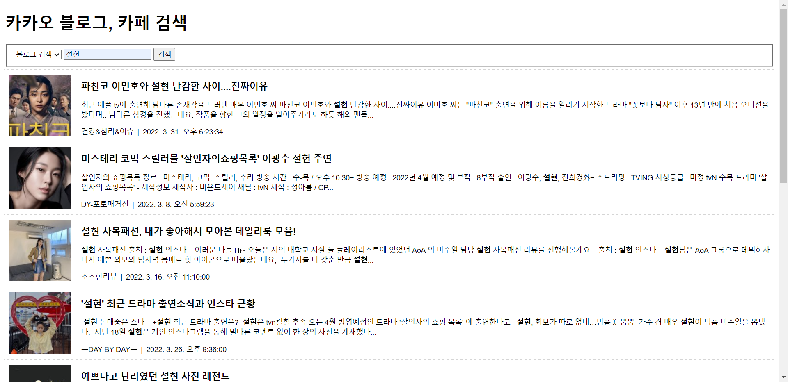
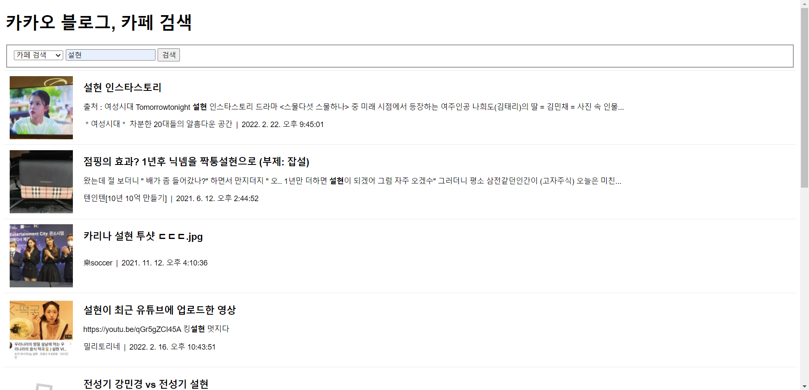

# 한주애 과제
> 2022-04-05

## 문제1
```js
/** KAKAO REST KEY */
const KAKAO_REST_KEY = "519f0b46a2419ef18f6e15f93708f80d";

let currentPage = 1;
let queryKeyword = null
let isEnd = false;
let source = null;


/** submit 이벤트 - 신규검색 */
document.querySelector('#searchForm').addEventListener('submit', (e) => {
    e.preventDefault();

    // blog, cafe 폼 선택
    const sourceField = document.querySelector('#source');
    source = sourceField[sourceField.selectedIndex].value;
    console.log(source);        // cafe, blog 출력


    const queryField = document.querySelector('#query');
    queryKeyword = queryField.value.trim();

    if (!queryKeyword) {
        alert('검색어를 입력하세요.');
        queryField.focus();
        return;
    }

    currentPage = 1;
    get_search();
});


/** 스크롤 이벤트 - 추가검색 */
window.addEventListener('scroll', (e) => {
    if(isEnd || document.querySelector('#loading').classList.contains('active')){
        return;
    }

    const scrollTop = window.scrollY;
    const windowHeight = window.screen.availHeight;
    const documentHeight = document.body.scrollHeight;

    if (scrollTop + windowHeight >= documentHeight) {
        // 2페이지 이후는 추가 검색
        currentPage++;
        get_search();
    }
});


/** Ajax 요청 후 결과화면 출력 */
async function get_search(){
    const loading = document.querySelector('#loading');
    loading.classList.add('active');

    const list = document.querySelector('#list');
    if (currentPage == 1){
        Array.from(list.getElementsByTagName('li')).forEach((v, i) => {
            list.removeChild(v);
        });
    }

    let json = null;

    try{
        json = await axios.get(`https://dapi.kakao.com/v2/search/${source}`, {
            params: {
                query: queryKeyword,
                page: currentPage,
            },
            headers: {
                Authorization: `KakaoAK ${KAKAO_REST_KEY}`,
            },
        });
        
        console.log(json);
    } catch (e) {
        console.error(err);
        alert('요청을 처리하는데 실패했습니다.');
        return;
    } finally {
        // 로딩바 닫기
        loading.classList.remove('active');
    }

    if (json != null) {
        const {data} = json;

        isEnd = data.meta.is_end;

        data.documents.map((v, i) => {
            const li = document.createElement('li');
            list.appendChild(li);

            const a = document.createElement('a');
            a.setAttribute('href', v.url);
            a.setAttribute('target', '_blank');
            li.appendChild(a);

            const img = document.createElement('img');
            img.classList.add('thumbnail');
            img.setAttribute('src', v.thumbnail || "img/noimage.jpg");
            a.appendChild(img);

            const h2 = document.createElement('h2');
            h2.innerHTML = v.title;
            a.appendChild(h2);

            const p = document.createElement('p');
            p.innerHTML = v.contents;
            a.appendChild(p);

            const span1 = document.createElement('span');
            span1.classList.add('info');
            span1.innerHTML = v.blogname || v.cafename;
            a.appendChild(span1);

            const date = new Date(v.datetime);
            const span2 = document.createElement('span');
            span2.classList.add('info');
            span2.innerHTML = date.toLocaleString();
            a.appendChild(span2);

        });
    }
}
```

