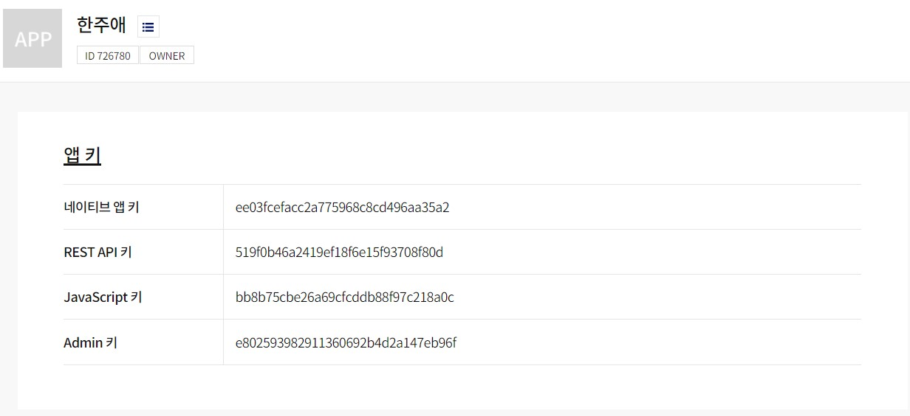
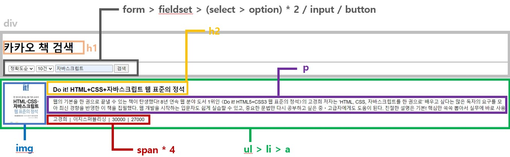
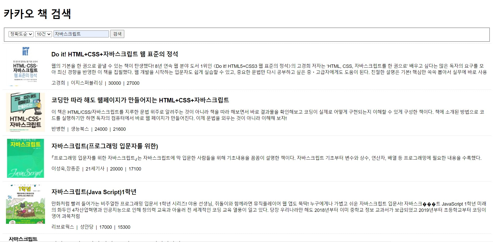

# 프로그래밍언어응용 보고서 한주애
> 2022-04-06

### 문항 1


---

### 문항 2



---

### 문항 3
```js
/**
 * @Filename        : bookSearch.js
 * @Author          : 한주애 (juae0806@gmail.com)
 * @Description     : 카카오 책 검색 API
*/

const KAKAO_REST_KEY = "519f0b46a2419ef18f6e15f93708f80d";
let order = null;           // 정확도순/발간일순
let bookCount = null;       // 화면 출력 건수
let currentPage = 1;        // 페이지 번호
let queryKeyword = null;    // 검색어
let isEnd = false;          // 마지막 페이지인지 검사


/** 검색 폼의 submit 이벤트 */
document.querySelector('#searchForm').addEventListener('submit', (e) => {
    e.preventDefault();

    // 정확도순/발간일순 가져오기
    const orderField = document.querySelector('#order');
    order = orderField[orderField.selectedIndex].value;

    // 화면 출력 건수 가져오기
    const bookCountField = document.querySelector('#bookCount');
    bookCount = bookCountField[bookCountField.selectedIndex].value;

    // 입력된 검색어 가져오기
    const queryField = document.querySelector('#query');
    queryKeyword = queryField.value.trim();

    // 검색어가 입력되지 않은 경우
    if(!queryKeyword){
        alert('검색어를 입려하세요.');
        queryField.focus();
        return;
    }
    // 신규 검색
    currentPage = 1;
    bookSearch();
});


/** 스크롤 이벤트 */
window.addEventListener('scroll', (e) => {
    // 마지막 페이지거나 로딩바가 화면에 표시되면 처리 중단
    if(isEnd || document.querySelector('#loading').classList.contains('active')){
        return;
    }

    const scrollTop = window.scrollY;       // 스크롤바의 Y좌표
    const windowHeight = window.screen.availHeight;     // 웹 브라우저의 창 높이
    const documentHeight = document.body.scrollHeight;  // HTML 문서의 높이

    if(scrollTop + windowHeight >= documentHeight){
        currentPage++;
        bookSearch();
    }
});


/** Ajax 요청 후 결과화면 출력 */
async function bookSearch(){
    const loading = document.querySelector('#loading');
    loading.classList.add('active');

    const list = document.querySelector('#list');

    if(currentPage == 1){
        Array.from(list.getElementsByTagName('li')).forEach((v, i) => {
            list.removeChild(v);
        });
    }

    let json = null;

    try{
        json = await axios.get('https://dapi.kakao.com/v3/search/book?target=title', {
            params: {
                query:queryKeyword,
                page: currentPage,
                sort: order,
                size: bookCount,
            },
            headers: {
                Authorization: `KakaoAK ${KAKAO_REST_KEY}`,
            },
        });
        console.log(json);
    } catch (e) {
        console.error(err);
        alert('요청을 처리하는데 실패했습니다.');
        return;
    } finally {
        loading.classList.remove('active');
    }
    
    if(json != null){
        const {data} = json;

        inEnd = data.meta.is_end;

        data.documents.map((v, i) => {
            const li = document.createElement('li');
            list.appendChild(li);

            const a = document.createElement('a');
            a.setAttribute('href', v.url);
            a.setAttribute('target', '_blank');
            li.appendChild(a);

            const img = document.createElement('img');
            img.setAttribute('src', v.thumbnail || "img/noimage.jpg");
            a.appendChild(img);

            const h2 = document.createElement('h2');
            h2.innerHTML = v.title;
            a.appendChild(h2);

            const p = document.createElement('p');
            p.innerHTML = v.contents;
            a.appendChild(p);


            const span1 = document.createElement('span');
            span1.innerHTML = v.authors
            span1.classList.add('info');
            a.appendChild(span1);


            const span2 = document.createElement('span');
            span2.innerHTML = v.publisher
            span2.classList.add('info');
            a.appendChild(span2);


            const span3 = document.createElement('span');
            span3.innerHTML = v.price
            span3.classList.add('info');
            a.appendChild(span3);


            const span4 = document.createElement('span');
            span4.innerHTML = v.sale_price
            span4.classList.add('info');
            a.appendChild(span4);

        });
    }
}
```
---
#### 구현결과 이미지
