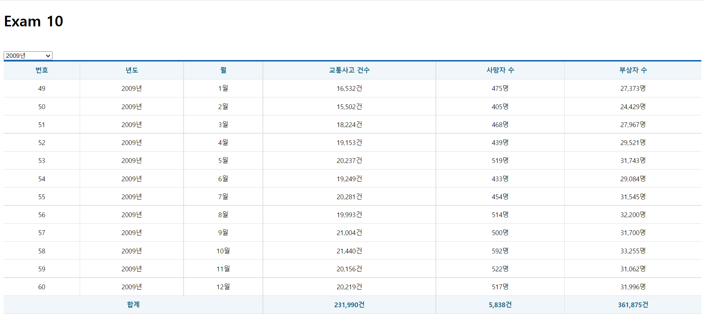

# 한주애 과제
> 2022-05-17

## App.js
```js
import React from 'react';
import Spinner from './components/Spinner';
import Table from './components/Table';
import useAxios from 'axios-hooks';
import useMountedRef from './hooks/useMountedRef';


const URL = "http://localhost:3001/traffic_acc";
const App = () => {
  const [{data, loading, error}, refetch] = useAxios(URL);
  const [year, setYear] = React.useState('');
  const mountedRef = useMountedRef();

  const onSelectChange = React.useCallback(e => {
    e.preventDefault();

    const current = e.target;
    console.log(current);

    const key = current.name;
    console.log(key);   //year

    const value = current[current.selectedIndex].value;
    console.log(value);   // 2005

    const newYear = {...year, [key]: value};
    setYear(newYear);
    console.log(newYear);
    
  }, [year]);

  React.useEffect(() => {
    if(mountedRef.current){
      const params = {};

      for(const key in year){
        if(year[key]){
          params[key] = year[key];
        }
      }
      refetch({
        params : params
      });
    }
  }, [mountedRef, refetch, year]);

  /** 합계 누적변수 */
  let accidentSum = 0;
  let deathSum = 0
  let injurySum = 0
  

  if(error) {
    console.error(error);
    return(
      <div>
        <h1>{error.code} ERROR.</h1>
        <p>{error.message}</p>
      </div>
    );
  }
  return (
    <div>
      <Spinner visible={loading} />
      <h1>Exam 10</h1>
      <br />
      <select name="year" onChange={onSelectChange}>
        <option value="">-- 년도 선택 --</option>
        <option value="2005">2005년</option>
        <option value="2006">2006년</option>
        <option value="2007">2007년</option>
        <option value="2008">2008년</option>
        <option value="2009">2009년</option>
        <option value="2010">2010년</option>
        <option value="2011">2011년</option>
        <option value="2012">2012년</option>
        <option value="2013">2013년</option>
        <option value="2014">2014년</option>
        <option value="2015">2015년</option>
        <option value="2016">2016년</option>
        <option value="2017">2017년</option>
        <option value="2018">2018년</option>
      </select>

      <br />
      <Table>
        <thead>
          <tr>
            <th>번호</th>
            <th>년도</th>
            <th>월</th>
            <th>교통사고 건수</th>
            <th>사망자 수</th>
            <th>부상자 수</th>
          </tr>
        </thead>
        <tbody>
          {data && data.map(({
            id, year, month, accident, death, injury
          }, i) => {
            accidentSum += accident;
            deathSum += death;
            injurySum += injury;
            return(
              <tr key={id}>
                <td>{id}</td>
                <td>{year}년</td>
                <td>{month}월</td>
                <td>{accident.toLocaleString()}건</td>
                <td>{death.toLocaleString()}명</td>
                <td>{injury.toLocaleString()}명</td>
              </tr>
            );
          })}
        </tbody>
        <tfoot>
          <tr>
            <th colSpan={3}>합계</th>
            <th>{accidentSum.toLocaleString()}건</th>
            <th>{deathSum.toLocaleString()}건</th>
            <th>{injurySum.toLocaleString()}건</th>
          </tr>
        </tfoot>
      </Table>
    </div>
  );
};

export default App;
```
