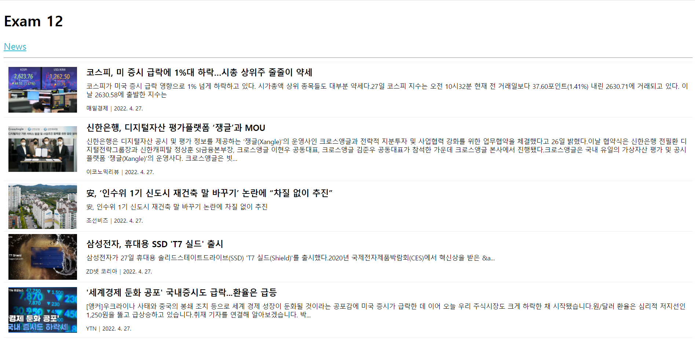

# 한주애 과제
> 2022-05-23

## index.js
```js
import React from 'react';
import ReactDOM from 'react-dom/client';
import App from './App';
import {BrowserRouter} from 'react-router-dom';
import { Provider } from 'react-redux';
import store from './store';

const root = ReactDOM.createRoot(document.getElementById('root'));
root.render(
  <React.StrictMode>
    <Provider store={store}><BrowserRouter><App /></BrowserRouter></Provider>
  </React.StrictMode>
);
```

## store.js
```js
import {configureStore} from '@reduxjs/toolkit';
import newsSlice from './slices/NewsSlice';


const store = configureStore({
    reducer:{
        news : newsSlice
    },
    devTools: true
});

export default store;
```

## app.js
```js
import React from 'react';
import News from './pages/News';
import {Routes, Route} from 'react-router-dom';
import MenuLink from './components/MenuLink';

const App = () => {
  return (
    <div>
      <h1>Exam 12</h1>
      <nav>
        <MenuLink to="/news">News</MenuLink>
      </nav>
      <hr />
      <Routes>
        <Route path="/news" element={<News />}/>
      </Routes>
    </div>
  );
};

export default App;
```

## NewsSlice.js
```js
import {createSlice, createAsyncThunk} from '@reduxjs/toolkit';
import axios from 'axios';

export const getList = createAsyncThunk('news', async (payload, {rejectWithValue}) => {
    let result = null;

    try{
        result = await axios.get('http://localhost:3001/news');
    }catch(err){
        result = rejectWithValue(err.response);
    }
    return result;
})
const NewsSlice = createSlice({
    name: 'news',
    initialState: {
        data: null,
        loading:false,
        error: null
    },

    reducers: {},
    extraReducers: {
        [getList.pending]: (state, {payload}) => {
            return {...state, loading: true}
        },
        [getList.fulfilled] : (state, {payload}) => {
            return{
                data: payload?.data,
                loading: false,
                error: null
            }
        },
        [getList.rejected] : (state, {payload}) => {
            return {
                data: payload?.data,
                loading: false,
                error:{
                    code:payload?.status ? payload.status:500,
                    message: payload?.statusText ? payload.statusText : 'Server Error'
                }
            }
        }
    }
});
export default NewsSlice.reducer;
```

## News.js
```js
import React from 'react';
import Spinner from '../components/Spinner';
import NewsItem from '../components/NewsItem';
import styled from 'styled-components';

import {useSelector, useDispatch} from 'react-redux';
import {getList} from '../slices/NewsSlice';

const ListContainer = styled.ul`
    list-style:none;
    padding:0;
    margin:0;
    width:100%;
    box-sizing:border-box;
    display:flex;
    flex-direction:column;
    margin-bottom:30px;
`;

const News = () => {
    React.useEffect(() => console.clear(), []);

    const {data, loading, error} = useSelector((state) => state.news);
    const dispatch = useDispatch();

    React.useEffect(() => {
        dispatch(getList());
    }, [dispatch]);

    return (
        <div>
            <Spinner visible={loading} />
            {error ? (
                <div>
                    <h1>Opps {error.code} Error</h1>
                    <hr />
                    <p>{error.message}</p>
                </div>
            ) : (
                <ListContainer>
                    {data && data.map((v, i) => <NewsItem key={i} item={v} />)}
                </ListContainer>
            )}
        </div>
    );
};

export default News;
```

## NewsItem.js
```js
import React from "react";
import styled from "styled-components";

/** 스타일 */
const ListItem = styled.li`
    border-top:1px solid #eee;

    &:last-child{border-bottom:1px solid #eee;}

    .list-item-link{
        box-sizing:border-box;
        display:flex;
        flex-wrap:nowrap;
        flex-direction:row;
        align-items:center;
        padding:5px 10px;
        text-decoration:none;
        color:#000;
        transition: all 0.1s;

        &:hover{background-color:#eeeeee55;}

        .thumbnail{
            width:150px;
            height:100px;
            display:block;
            object-fit:cover;
            flex:none;
        }

        .content{
            flex:0 1 auto;
            padding:5px 0 5px 20px;

            h3{
                box-sizing:border-box;
                font-size:18px;
                font-weight:bold;
                margin:0;
                margin-bottom:10px;
                
                /** 2줄 넘어가면 ... 처리 */
                display:-webkit-box;
                overflow:hidden;
                text-overflow:ellipsis;
                -webkit-line-clamp:2;
                -webkit-box-orient:vertical;
            }
            p{
                font-size:14px;
                margin:0;
                margin-bottom:8px;

                /** 3줄 넘어가면 ... 처리 */
                display:-webkit-box;
                overflow:hidden;
                text-overflow:ellipsis;
                -webkit-line-clamp:3;
                -webkit-box-orient:vertical;
            }
            ul{
                list-style :none;
                padding:0;
                margin:0;

                li{display:inline-block; font-size:12px;
                    &:first-child:after{
                        content:'|';
                        display:inline-block;
                        color:#555;
                        padding: 0 5px;
                    }
                }
            }
        }
    }
`;

const NewsItem = ({
  item: { author, title, description, url, image, datetime },
}) => {
  return (
    <ListItem>
      <a className="list-item-link" href={url} target="_blank" rel="noreferrer">
        
        <div className="content">
          <h3>{title}</h3>
          <p>{description}</p>
          <ul>
            <li>{author}</li>
            <li>{new Date(datetime).toLocaleDateString()}</li>
          </ul>
        </div>
      </a>
    </ListItem>
  );
};
export default NewsItem;

```

