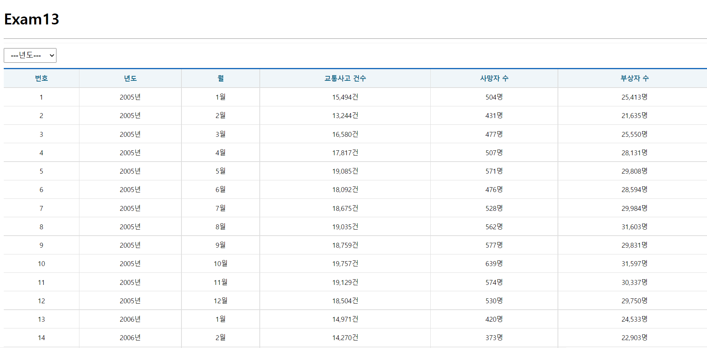
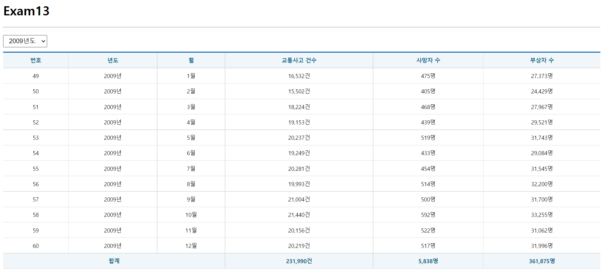

# 한주애 과제
> 2022-05-24

## store.js
```js
import {configureStore} from '@reduxjs/toolkit';
import TrafficSlice from './slices/TrafficSlice';

const store = configureStore({
    reducer: {
        traffic : TrafficSlice
    },
    middleware: (getDefaultMiddleware) => getDefaultMiddleware({serializableCheck: false}),
    devTools: true
});

export default store;
```
## TrafficSlice.js
```js
import {createSlice, createAsyncThunk} from '@reduxjs/toolkit';
import axios from 'axios';

export const getTrafficList = createAsyncThunk("TrafficSlice/getTrafficList", async (payload, {rejectWithValue}) => {
    let result = null;

    try{
        result = await axios.get('http://localhost:3001/traffic_acc', {
            params: {
                year: payload.year
            }
        });

        if(result.data.faultInfo !== undefined){
            const err = new Error();
            err.response = {status: 500, statusText: result.data.faultInfo.message};
            throw err;
        }
    } catch (err){
        result = rejectWithValue(err.response);
    }
    return result;
});

const TrafficSlice = createSlice({
    name: 'traffic',
    initialState: {
        data: null,
        loading: false,
        error: null
    },
    reducers: {},
    extraReducers: {
        [getTrafficList.pending] : (state, {payload}) => {
            return {...state, loading: true}
        },
        [getTrafficList.fulfilled] : (state, {payload}) => {
            return {
                data: payload?.data,
                loading:false,
                error:null
            }
        },
        [getTrafficList.rejected] : (state, {payload}) => {
            return {
                data: payload?.data,
                loading: false,
                error: {
                    code: payload.status ? payload.status : 500,
                    message: payload?.statusText ? payload.statusText : 'Server Error'
                }
            }
        }
    }
});

export default TrafficSlice.reducer;
```

## app.js
```js
import React from 'react';
import Traffic from './pages/Traffic';

const App = () => {
  return (
    <div>
      <h1>Exam13</h1>
      <hr />
      <Traffic />
    </div>
  );
};

export default App;
```


## Traffic.js
```js
import React from 'react';
import Spinner from '../components/Spinner';
import Table from '../components/Table';
import ErrorView from '../components/ErrorView';
import styled from 'styled-components';

import {useSelector, useDispatch} from 'react-redux';
import {getTrafficList} from '../slices/TrafficSlice';
import useMountedRef from '../hooks/useMountedRef';


const SelectContainer = styled.div`
  position:sticky;
  top:0;
  background-color:#fff;
  border-top:1px solid #eee;
  border-bottom: 1px solid #eee;
  padding: 10px 0;
  margin:0;
  select{
    margin-right:15px;
    font-size:16px;
    padding:5px 10px;
  }
`;

const Traffic = () => {
    const dispatch = useDispatch();
    const {data, loading, error} = useSelector((state) => state.traffic)
    const [year, setYear] = React.useState();
    
    React.useEffect(() => {
        dispatch(getTrafficList({year: year}))
    }, [dispatch, year]);

    const onSelectChange = React.useCallback(e => {
        e.preventDefault();
        const current = e.target;
        const value = current[current.selectedIndex].value;
        setYear(value);
    }, [])
    

    return (
        <div>
            <Spinner visible={loading} />
            {error ? (<ErrorView error={error} />) : (
                <>
                    <SelectContainer>
                        <select name="year" onChange={onSelectChange}>
                            <option value="">---년도---</option>
                            {[...new Array(2018-2005+1)].map((v, i) => {
                                return (<option key={i} value={2005+i}>{2005+i}년도</option>);
                            })}
                        </select>
                    </SelectContainer>
                    <Table>
                        <thead>
                            <tr>
                                <th>번호</th>
                                <th>년도</th>
                                <th>월</th>
                                <th>교통사고 건수</th>
                                <th>사망자 수</th>
                                <th>부상자 수</th>
                            </tr>
                        </thead>
                        <tbody>
                            {data && data.map(({
                                id, year, month, accident, death, injury}, i) => {
                                    return(
                                        <tr key={id}>
                                            <td>{id}</td>
                                            <td>{year}년</td>
                                            <td>{month}월</td>
                                            <td>{accident.toLocaleString()}건</td>
                                            <td>{death.toLocaleString()}명</td>
                                            <td>{injury.toLocaleString()}명</td>
                                        </tr>
                                    );
                                })}
                        </tbody>
                        <tfoot>
                        <tr>
                            <th colSpan="3">합계</th>
                            <th>{data && data.map((v, i) => v.accident).reduce((p, c) => p+c, 0).toLocaleString()}건</th>
                            <th>{data && data.map((v, i) => v.death).reduce((p, c) => p+c, 0).toLocaleString()}명</th>
                            <th>{data && data.map((v, i) => v.injury).reduce((p, c) => p+c, 0).toLocaleString()}명</th>
                        </tr>
                        </tfoot>
                    </Table>
                </>
            )}
        </div>
    );
};

export default React.memo(Traffic);
```


