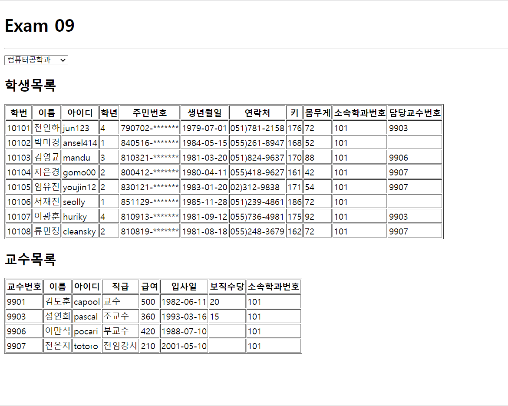

# 한주애 과제
> 2022-05-16

## App.js
```js
import React from 'react';
import axios from 'axios';
import Spinner from './components/Spinner';
import Student from './components/Student';
import Professor from './components/Professor';

const App = () => {
  const [data, setData] = React.useState([]);
  const [deptno, setDeptno] = React.useState(-1);
  const [loading, setLoding] = React.useState(false);

  React.useEffect(() => {
    (async () => {
      setLoding(true);
      try{
        const response = await axios.get('http://localhost:3001/department');
        setData(data => response.data);
      }catch (e){
        console.error(e);
        alert('ajax 연동실패');
      }finally{
        setLoding(false);
      }
    })();
  }, []);

  const handleChange = React.useCallback((e) => {
    setDeptno(e.currentTarget.value);
  }, []);


  return (
    <div>
      <Spinner visible={loading} />
      <h1>Exam 09</h1>
      <hr />
      <select onChange={handleChange}>
        <option value="">학과목록</option>
        {data.map((v, i) => {
          return(
            <option value={v.id} key={i}>{v.dname}</option>
          )
        })}
      </select>

      <h2>학생목록</h2>
      <Student deptno={deptno} />

      <h2>교수목록</h2>
      <Professor deptno={deptno} />
    </div>
  );
};

export default React.memo(App);
```

## Spinner.js
```js
import React from 'react';
import PropTypes from 'prop-types';
import styled from 'styled-components';

import {Bars} from 'react-loader-spinner';

const TransLayer = styled.div`
    position:fixed;
    left:0;
    top:0;
    z-index:9999;
    background-color:#0003;
    width:100%;
    height:100%;
`;

const Spinner = ({visible, color, width, height}) => {
    return (
        <div>
            {visible && (
                <TransLayer>
                    <Bars
                        color={color}
                        height={height}
                        width={width}
                        wrapperStyle={{
                            position: 'absolute',
                            zIndex:10000,
                            left:'50%',
                            top:'50%',
                            marginLeft: (-width/2)+'px',
                            marginTop: (-height/2)+'px'
                        }}
                    />
                </TransLayer>
            )}
        </div>
    );
};

Spinner.defaultProps = {
    visible: false,
    color: '#06f',
    width:100,
    height:100
};

Spinner.propTypes = {
    visible: PropTypes.bool.isRequired,
    color: PropTypes.string,
    width: PropTypes.number,
    height: PropTypes.number,
};

export default Spinner;
```

## Student.js
```js
import React from 'react';
import axios from 'axios';
import Spinner from './Spinner';

const Student = ({deptno}) => {
    const [data, setData] = React.useState([]);
    const [loading, setLoding] = React.useState(false);
    React.useEffect(() => {
        setLoding(true);
        (async () => {
            try{
                const response = await axios.get(`http://localhost:3001/student?deptno=${deptno}`);
                setData(data => response.data);
            }catch (e) {
                console.error(e);
                alert('ajax연동실패');
            }finally{
                setLoding(false);
            }
        })();
    }, [deptno]);

    return (
        <div>
            <Spinner visible={loading} />
            <table border="1">
                <thead>    
                    <tr>
                        <th>학번</th>
                        <th>이름</th>
                        <th>아이디</th>
                        <th>학년</th>
                        <th>주민번호</th>
                        <th>생년월일</th>
                        <th>연락처</th>
                        <th>키</th>
                        <th>몸무게</th>
                        <th>소속학과번호</th>
                        <th>담당교수번호</th>
                    </tr>
                </thead>
                <tbody>
                    {data.map((v, i) => {
                        return(
                            <tr key={i}>
                                <td>{v.id}</td>
                                <td>{v.name}</td>
                                <td>{v.userid}</td>
                                <td>{v.grade}</td>
                                <td>{v.idnum.substring(0,6)}-*******</td>
                                <td>{v.birthdate.substring(0,10)}</td>
                                <td>{v.tel}</td>
                                <td>{v.height}</td>
                                <td>{v.weight}</td>
                                <td>{v.deptno}</td>
                                <td>{v.profno}</td>
                            </tr>
                        )
                    })}
                </tbody>
            </table>
        </div>
    );
};

export default React.memo(Student);
```

## Professor.js
```js
import React from 'react';
import axios from 'axios';
import Spinner from './Spinner';

const Professor = ({deptno}) => {
    const [data, setData] = React.useState([]);
    const [loading, setLoding] = React.useState(false);

    React.useEffect(() => {
        setLoding(true);
        (async () => {
            try{
                const response = await axios.get(`http://localhost:3001/professor?deptno=${deptno}`);
                setData(data => response.data);
            }catch (e) {
                console.error(e);
                alert('ajax연동실패');
            }finally{
                setLoding(false);
            }
        })();
    }, [deptno]);

    return (
        <div>
            <Spinner visible={loading} />
            <table border="1">
                <thead>
                    <tr>
                        <th>교수번호</th>
                        <th>이름</th>
                        <th>아이디</th>
                        <th>직급</th>
                        <th>급여</th>
                        <th>입사일</th>
                        <th>보직수당</th>
                        <th>소속학과번호</th>
                    </tr>
                </thead>
                <tbody>
                    {data.map((v, i) => {
                        return(
                            <tr key={i}>
                                <td>{v.id}</td>
                                <td>{v.name}</td>
                                <td>{v.userid}</td>
                                <td>{v.position}</td>
                                <td>{v.sal}</td>
                                <td>{v.hiredate.substring(0,10)}</td>
                                <td>{v.comm}</td>
                                <td>{v.deptno}</td>
                            </tr>
                        );
                    })}
                </tbody>
            </table>
        </div>
    );
};

export default React.memo(Professor);
```

