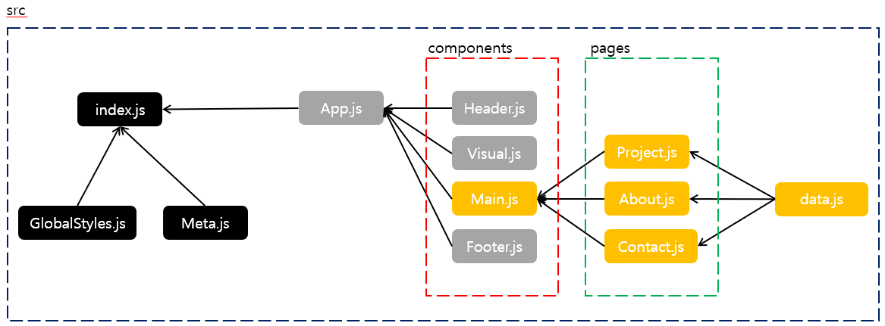

# 한주애 React 클론코딩 2
>> 2022-05-02

### 구조


### index.js
```js
import React from 'react';
import ReactDOM from 'react-dom/client';
import App from './App';
import GlobalStyles from './GlobalStyles';
import Meta from './Meta';
import {BrowserRouter} from 'react-router-dom';

const root = ReactDOM.createRoot(document.getElementById('root'));
root.render(
  <React.StrictMode>
    <Meta />
    <GlobalStyles />
    <BrowserRouter><App /></BrowserRouter>
  </React.StrictMode>
);

```

### Meta.js
```js
import React from 'react';
import {Helmet, HelmetProvider} from 'react-helmet-async';

const Meta = (props) => {
    return(
        <HelmetProvider>
            <Helmet>
                <meta charset='utf-8' />
                <title>{props.title}</title>
                <meta name='description' content={props.description} />
                <meta name='keywords' content={props.keywords} />
                <meta name='author' content={props.author} />
                <meta property='og:type' content='website' />
                <meta property='og:title' content={props.title} />
                <meta property='og:description' content={props.description} />
                <meta property='og:url' content={props.url} />

                <link rel="preconnect" href="https://fonts.googleapis.com" />
                <link rel="preconnect" href="https://fonts.gstatic.com" crossorigin />
                <link href="https://fonts.googleapis.com/css2?family=Gugi&family=Noto+Sans+KR:wght@100;300;400;500&display=swap" rel="stylesheet" />
            </Helmet>
        </HelmetProvider>
    );
};

Meta.defaultProps = {
    title: 'clone',
    description: '클론코딩 예제 입니다.',
    keywords: 'React',
    author: '주애',
    url: window.location.href,
};

export default Meta;
```

### GlobalStyles.js
```js
import { createGlobalStyle } from "styled-components";
import reset from 'styled-reset';

const GlobalStyles = createGlobalStyle`
    ${reset};
    body{
        font-family: 'Nanum Gothic';
        font-weight:400;
    }
`;
export default GlobalStyles;
```

### App.js
```js
import React from 'react';
import {Routes, Route} from 'react-router-dom';
import Header from './components/Header';
import Visual from './components/Visual';
import Main from './components/Main';
import Footer from './components/Footer';

function App() {
  return (
    <div>
      <Header />
      <Visual />
      <Routes>
        <Route path='/' element={<Main />} />
      </Routes>
      <Footer />
    </div>
  );
}

export default App;

```

### Header.js
```js
import React from 'react';
import styled from 'styled-components';

const HeaderContainer = styled.div`
    width:100%;
    height:60px;
    box-shadow: 2px 0 4px black;
    position:fixed;
    background-color:white;
    z-index: 999999;

    .logo{
        float:left;
        width:150px;
        height:40px;
        margin:10px 30px;
        &:hover{cursor: pointer;background-color:gray;}
        h1{
            font-size:18px;
            text-align: center;
            line-height: 40px;
            letter-spacing: 2px;
            span{font-weight: bold;}
        }
    }
    .nav{
        float:right;
        width:324px;
        height:40px;
        margin:10px 30px;
        a{
            display:block;
            float:left;
            font-size:18px;
            color:black;
            text-decoration: none;
            width:100px;
            height:100%;
            text-align: center;
            line-height:40px;
            padding:0 4px;
            letter-spacing: 3px;
            &:hover{background-color:gray;}
        }
    }
`;
const Header = () => {
    return(
        <HeaderContainer>
            <div className="logo">
                <h1><span>BR</span> Architects</h1>
            </div>
            <div className="nav">
                <a href="#project">Project</a>
                <a href="#about">About</a>
                <a href="#contact">Contact</a>
            </div>
        </HeaderContainer>
    );
}
export default Header;
```

### Visual.js
```js
import React from 'react';
import styled from 'styled-components';
import architect from '../img/architect.jpg'


const VisualContainer = styled.div`
    width:1500px;
    height:800px;
    background: url(${architect}) no-repeat;
    background-size:contain;
    margin:0 auto;
    position:relative;
    .text{
        width:400px;
        height:80px;
        position: absolute;
        top:48%;
        left:38%;
        text-align: center;
        color:white;

        h1{
            font-size:40px;
            letter-spacing: 3px;
            line-height:60px;

            span{
                font-weight:bold;
                background-color:rgba(0, 0, 0, 0.8);
                margin-top:10px;
                width:90px;
                height:60px;
                display:inline-block;
            }
        }
    }
`;
const Visual = () => {
    return(
        <VisualContainer>
            <div className="text">
                <h1><span>BR</span> Architects</h1>
            </div>
        </VisualContainer>
    );
}
export default Visual;
```

### Footer.js
```js
import React from 'react';
import styled from 'styled-components';


const FooterContainer = styled.div`
    width:1500px;
    height:100px;
    background-color:black;

    p{
        color:white;
        text-align: center;
        line-height:100px;

        a{
            display:inline-block;
            color:white;
        }
    }
`;
const Footer = () => {
    return(
        <FooterContainer>
            <p>Powerd by <a href="#">w3.css</a></p>
        </FooterContainer>
    );
}
export default Footer;
```

### Main.js
```js
import React from 'react';
import styled from 'styled-components';
import Project from '../pages/Project'
import About from '../pages/About'
import Contact from '../pages/Contact'

const MainContainer = styled.div`
    width:1500px;
    margin:40px auto;
`;
const Main = () => {
    return(
        <MainContainer>
            <Project />
            <About />
            <Contact />
        </MainContainer>
    );
}
export default Main;
```

### Project.js
```js
import React from 'react';
import styled from 'styled-components';
import data from '../data';

const ProjectContainer = styled.div`
    h3{
        font-size:25px;
        font-weight:bold;
        margin-bottom:30px;
    }
    .projectBox{
        width:1500px;
        height:510px;
        margin-bottom:40px;
        div{
            position:relative;
            width:370px;
            height:250px;
            float:left;
            margin-right:5px;
            margin-bottom:5px;
        }
        .boxImg{
            width:370px;
            height:250px;
            background-size:contain;
        }
        .boxTex{
            position:absolute;
            left:0;
            top:0;
            width:130px;
            height:35px;
            text-align: center;
            line-height:35px;
            color:white;
            background-color:black;
        }
    }
`;
const Project = () => {
    const {project} = data;
    return(
        <ProjectContainer>
            <h3>Projects</h3>
            <div className="projectBox">
                {project.map((v, i) => {
                    return(
                        <div key={i}>
                            
                            <p className="boxTex">{v.subject}</p>
                        </div>
                    );
                })}
            </div>
        </ProjectContainer>
    );
}
export default Project;
```

### About.js
```js
import React from 'react';
import styled from 'styled-components';
import data from '../data';

const AboutContainer = styled.div`
    h3{
        margin-bottom:30px;
        font-size:25px;
        font-weight:bold;
    }
    p{
        line-height:1.2;
        margin-bottom:30px;
    }
    .aboutBox{
        width:1500px;
        height:453px;
        margin-bottom:40px;

        .box{
            width:370px;
            float:left;
            margin-right:5px;

            .boxImg{
                width:370px;
                height:250px;
            }
            h4{
                font-size:18px;
                font-weight:bold;
                padding:10px 0;
            }
            span{color:gray;}
            p{padding:10px 0; width:350px;}
            button{
                width:370px;
                height:40px;
                border: none;
                font-size:15px;
                &:hover{
                    background-color:rgb(168, 168, 168);
                    cursor: pointer;
                }
            }
        }
    }
`;
const About = () => {
    const {about} = data;
    const {content, member} = about;
    return(
        <AboutContainer>
            <h3>About</h3>
            <p>{content}</p>
            <div className="aboutBox">
            {member.map((v, i) => {
                return(
                    <div className="box" key={i}>
                        
                        <h4>{v.name}</h4>
                        <span>{v.position}</span>
                        <p>{v.desc}</p>
                        <button>Conteact</button>
                    </div>
                );
            })}
            </div>
        </AboutContainer>
    );
}
export default About;
```

### Contact.js
```js
import React from 'react';
import styled from 'styled-components';
import map from '../img/map.jpg'

const ContactContainer = styled.div`
    h3{
        margin-bottom:30px;
        font-size:25px;
        font-weight:bold;
    }
    p{margin-bottom:30px;}
    input{
        display:block;
        width:1500px;
        height:30px;
        margin-bottom:10px;
    }
    button{
        margin:30px 0 50px 0;
        width:150px;
        height:40px;
        background-color:black;
        color:white;
        border:none;
        &:hover{
            background-color:gray;
            cursor: pointer;
        }
    }
    .map{
        background:url(${map}) no-repeat;
        width:1400px;
        height:838px;
        margin:0 auto;
    }
`;
const Contact = () => {
    return(
        <ContactContainer>
            <h3>Contact</h3>
            <p>Lets get in touch and talk about your next project.</p>
            <input type="text" placeholder="Name" required="required"/>
            <input type="text" placeholder="Email" required="required"/>
            <input type="text" placeholder="Subject" required="required"/>
            <input type="text" placeholder="Comment" required="required"/>
            <button>SEND MESSAGE</button>

            <div class="map"></div>
        </ContactContainer>
    );
}
export default Contact;
```

### 구현 화면


### 느낀점
> 클론 코딩을 처음 했을 때는 반복적인 UI 부분은 막노동 작업으로 진행을 해서 코드가 항상 복잡했습니다.
> 리액트로 코딩을 진행할 때는 반복문을 사용해 쉽게 진행할 수 있어 편했습니다!
> 리액트 공부를 할 때 항상 헷갈려서 `project`와 `about`에 외부 json 파일을 불러와 반복문을 처리할 때 걱정했으나, 다행히 수월하게 되었습니다.
> 그동안 연습문제에서 항상 json을 불러와서 비구조문법을 이용해 출력하는 문제는 어떻게 불러와야 할지 막막했습니다. 하지만 오늘 클론 코딩을 진행하면서 확실히 감을 잡을 수 있게 되었습니다!