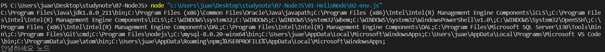

# 1. Hello Node

## #1 콘솔 출력

### 01. `console.log()`
1. 개발 단계에서 부수적인 데이터를 출력하고자 할 때 사용한다.
2. 제품을 배포할 때 로그는 삭제해서 배포하는 것이 좋다.
   - 성능에 영향을 줄 수 있기 때문에 정말 필요한 로그가 아니면 지운다.

### 02. `console.debug()`
1. 개발자가 변수의 값을 확인하기 위한 용도로 사용한다.
   - console.log()와 크게 구분하지 않는다.

### 03. `console.info()`
1. 시스템의 정보를 출력할 때 사용한다.
   - 개발 단계에서 지우고 배포한다.

### 04. `console.warn()`
1. '경보단계'로 에러는 아니지만 정상적이지 않다고 판단되는 경우 사용한다.

### 05. `console.error()`
1. '에러'단계로 심각할 경우, 예상하지 못한 에러, 시스템 에러에 사용한다.

---

## #02 시스템 환경변수
1. 내장객체 `process`는 컴퓨터의 환경변수에 접근할 수 있다.
2. `process.env.환경변수이름`
```js
    console.log(process.env.PATH);
    console.log(process.env.NODE_MSG);
```


#### [환경변수를 사용하는 이유] 
해킹을 당할경우 항상 가동되고 있는 노드 폴더가 가장 위험하다.  
폴더안에 민감한 정보들이 있을 경우 해킹을 방지하기 위해 환경변수에 등록하여 Node에 가져와서 사용한다.