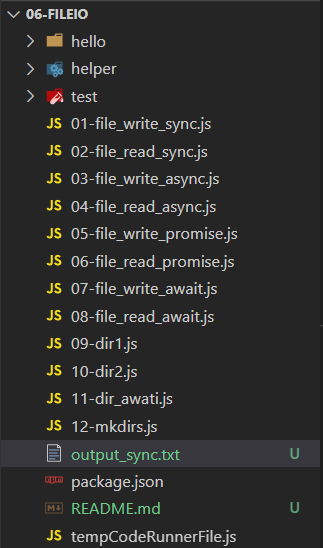
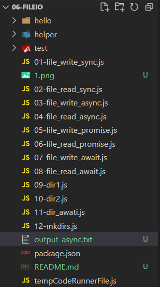
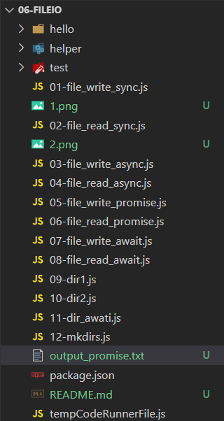
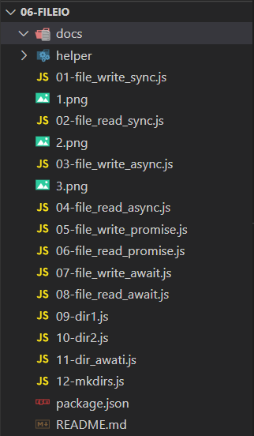
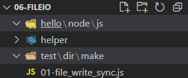

# #06 파일 입출력
프로그램 기준으로 파일이 입력되거나 출력되는 처리

## 01. 파일 입력(=읽기Read)
- 프로그램이 해당 파일을 읽어들여서 그 내용을 자신의 변수에 저장한다.

<br />

## 02. 파일 출력(=쓰기Write)
- 프로그램이 자신이 갖고 있는 변수의 내용을 외부 파일로 저장한다.

<br />

## 03. 파일 퍼미션
1. 파일에 대한 접근권한이다.
2. 대부분의 백엔드 환경은 리눅스 상에서 구동된다는 전제를 갖는 경우가 많다.
   1. 0 : 파일, 1 : 폴더 ==> 구분안하고, 0으로 해도 된다.
   2. 자기 자신(rwx => 421)
   3. 자신이 속한 그룹(rwx => 421)
   4. 그 밖의 사용자(rwx => 421)
3. `fs`모듈의 `chmodSync()` 함수를 이용해 리눅스의 chmod명령을 호출한다.

> **[퍼미션을 설정해야 하는 이유]**<br />
> 예전에는 컴퓨터 한 대에 여러명이 연결하는 일이 많아 내 파일에 다른사람이 접근하지 못하도록 하는  `파일접근권한`이라는 개념이 생겼다.  
> 백엔드는 외부로부터 파일 업로드를 계속 받아야 해서 보안 취약점에 노출되어 있다.  만약 어떤 사람이 악의적인 목적으로 바이러스를 올리고, 실행을 한다면 큰 일이 생기므로 `실행 권한`을 없애주어야 한다.
> 윈도우는 개인용 컴퓨터로 시작했기 때문에 퍼미션을 설정해봤자 소용없다.

---

<br />

### 1. 파일 쓰기(01-file_write_sync.js)
```js
/** 모듈참조 */
import fs from 'fs';

/** 필요한 변수 생성 */
const target = './ouput_sync.txt';          // 저장할 파일의 경로
const content = 'Hello World';              // 저장할 내용
const isExists = fs.existsSync(target);     // 파일의 존재 여부 검사(T/F)


if (!isExists) {
    /** 파일이 존재하지 않을 경우 새로 저장 */
    // 저장하는 경로는 상대경로/절대경로 모두 가능하다.

    // 상대 경로인 경우 : vsCode에 설정된 작업 디렉토리가 기준
    // 절대 경로인 경우 : 컴퓨터 전역에 대해서 지정 가능 -> c:/hello/world, c:\\hello\world

    // 이 예제에서는 상대경로를 이용하고, 동기식 파일 저장을 한다.
    // 동기식 파일 저장이란 코드를 순서대로 수행한다는 것으로 파일 저장을 완료하고 다음 작업이 진행되는 것(=대기상태)이다.
    // 그러므로 대용량 처리에는 적합하지 않다.
    fs.writeFileSync(target, content, 'utf8');


    /** 퍼미션 설정 */
    fs.chmodSync(target, '0766');       // rwx-rw-rw

    console.log(target + ' 파일에 데이터 쓰기 및 퍼미션 설정 완료');
} else {
    /** 파일이 존재할 경우 파일 삭제*/
    fs.unlinkSync(target);
    console.log(target + '파일 삭제 완료');
}
```
<br />
**파일이 생성된 것을 볼 수 있다.**


### 2. 파일 읽기(01-file_read_sync.js)
```js
import fs from 'fs';

var target = './ouput_sync.txt';            // 읽어들일 파일 경로

/** 파일 읽기 */
if(fs.existsSync(target)) {
    // 파일을 동기식으로 읽어서 그 내용을 리턴한다.
    // 이 파일을 다 읽기 전까지는 프로그램이 대기상태이다.
    // 그러므로 대용량 처리에는 적합하지 않다.
    var data = fs.readFileSync(target, 'utf8');

    console.log(data);
} else {
    console.log(target + ' 파일이 존재하지 않습니다.');
}


/*
    파일이 존재 한다면 : Hello World
    파일이 존재 하지 않는다면 : ./output_sync.txt 파일이 존재하지 않습니다.
*/
```

---

<br />

### 3. 파일 쓰기(03-file_write_async.js)
- 비동기 처리를 이용한 파일쓰기이다.

```js
import fs from 'fs';

const target = './output_async.txt';
const content = 'Hello World';
const isExists = fs.exixtsSync(target);

if(!isExists){
    /* 비동기식으로 파일저장을 요청한다.*/
    fs.writeFile(target, content, 'utf8', (err) => {
        if(err) {
            console.error(err);
            return;
        }
        console.debug(target + '에 데이터 쓰기 완료');

        fs.chmod(target, '0766', (err) => {
            if(err) {
                console.error(err);
                return;
            }
            console.debug(target + '의 퍼미션 설정 완료');
        });

        console.debug(target + '의 퍼미션 설정을 요청했습니다.');
    });

    // 비동기식이므로 요청만 주기 때문에 여기가 먼저 출력되고, 파일이 생성되면 위의 코드들이 실행된다.
    console.debug(target + '의 파일 저장을 요청했습니다.');
} else {
    fs.unlink(target, (err) => {
        if(err) {
            console.error(err);
            return;
        }
        console.debug(target + '의 파일 삭제 완료');
    });

    console.debug(target + '의 파일 삭제를 요청했습니다.');
}

/*
    ./output_async.txt의 파일 저장을 요청했습니다.
    ./output_async.txt에 데이터 쓰기 완료
    ./output_async.txt의 퍼미션 설정을 요청했습니다.
    ./output_async.txt의 퍼미션 설정 완료

    -----------------------------------------------

    ./output_async.txt의 파일 삭제를 요청했습니다.
    ./output_async.txt의 파일 삭제 완료
*/
```


<br />

### 4. 파일 읽기(04-file_read_async.js)
```js
import fs from 'fs';

const target = './output_async.txt';

if(fs.existsSync(target)){
    fs.readFile(target, 'utf8', (err, data) => {
        if(err){
            console.error(err);
            return;
        }
        console.debug(data);        // 읽어들인 데이터 출력
    });

    console.debug(target + '파일을 읽도록 요청했습니다.');
} else {
    console.debug(target + '파일이 존재하지 않습니다.');
}


/*
    ./output_async.txt 파일을 읽도록 요청했습니다.
    Hello World

    -----------------------------------------------

    ./output_async.txt파일이 존재하지 않습니다.
*/
```

---

<br />

### 5. 파일 쓰기(05-file_write_promise.js)
- 콜백함수가 많아지면 JS가 복잡해지므로 제일 먼저 도입된 것이 프로미스 방법이다.
```js
import fs from 'fs';

const target = './output_promise.txt';
const content = 'Hello World';
const isExists = fs.existsSync(target);

if (!isExists){
    // fs에서 프로미스를 지원하는 하위 객체가 있음
    const myPromise = fs.promises.writeFile(target, content);

    myPromise
        .then(() => {console.debug('저장완료');})
        .catch((e) => {
            console.error('저장실패');
            console.error(e);
        });
    console.log(target + '의 파일 저장을 요청했습니다.');
} else {
    fs.promises
        .unlink(target)
        .then(() => {
            console.debug('삭제완료');
        })
        .catch((e) => {
            console.error('삭제실패');
            console.error(e);
        });
    console.log(target + '의 파일 삭제를 요청했습니다.');
}

/*
    ./output_promise.txt의 파일 저장을 요청했습니다.
    저장완료

    -----------------------------------------------

    ./output_promise.txt의 파일 삭제를 요청했습니다.
    삭제완료
*/
```


<br />

### 6. 파일 읽기(06-file_read_promise.js)
```js
import fs from 'fs';

const target = './output_promise.txt'

if(fs.existSync(target)){
    fs.promises
        .readFile(target, 'utf8')
        .then((data) => {
            console.debug('파일읽기 완료');
            console.debug();
        })
        .catch((err) => {
            console.error(err);
            console.error('파일읽기 실패');
        });
    console.debug(target + ' 파일을 읽도록 요청했습니다.');
} else {
    console.debug(target + '파일이 존재하지 않습니다.');
}
/*
    ./output_promise.txt 파일을 읽도록 요청했습니다.
    파일읽기 완료
    Hello World

    ----------------------------------------------

    ./output_promise.txt파일이 존재하지 않습니다.
*/
```

---

<br />

### 7. 파일 쓰기(05-file_write_await.js)
- promise를 async~await로 다시 구현
```js
import fs from 'fs';

const target = './output_await.txt';
const content = 'Hello World';
const isExists = fs.isexistsSync(target);

if(!isExists) {
    (async() => {
        try{
            await fs.promises.writeFile(target, content);
            console.debug('저장완료');
        } catch (err) {
            console.error('에러발생');
            console.error(err);
        }
    })();
} else {
    (async() => {
        try{
            await fs.promises.unlink(target);
            console.debug('삭제완료');
        } catch(err) {
            console.error('에러발생');
            console.error(err);
        }
    })();

    console.log(target + '의 파일 삭제를 요청했습니다.');
}

/*
    ./output_await.txt의 파일 저장을 요청했습니다.
    저장완료
    ----------------------------------------------
    ./output_await.txt의 파일 삭제를 요청했습니다.
    삭제완료
*/
```
<br />

### 8. 파일 읽기(06-file_read_await.js)
- promise를 async~await로 다시 구현
```js
import fs from 'fs';

const target = './output_await.txt';

if(fs.existsSync(target)){
    (async() => {
        let data = null;

        try{
            data = await fs.promises.readFile(target, 'utf8');
            console.debug('파일읽기 완료');
        }catch(err) {
            console.error(err);
            console.error('파일읽기 실패');
        }
        console.debug(data);
    })();
    console.log(target + '파일을 읽도록 요청했습니다.');
} else {
    console.log(target + '파일이 존재하지 않습니다.');
}

/*
    ./output_await.txt파일을 읽도록 요청했습니다.
    파일읽기 완료
    Hello World
    -------------------------------------------
    ./output_await.txt파일이 존재하지 않습니다.
*/
```

---
---

<br />

### 9. 폴더 생성(동기식)
```js
import fs from 'fs';

/* 생성할 폴더 */
var target = './docs';

if(!fs.existsSync(target)){
    console.log(target + '경로가 존재하지 않기 때문에 생성합니다.');
    fs.mkdirSync(target);

    fs.chmodSync(target, '0755');
    console.log(target + '(이)가 생성되었습니다.');
} else {
    console.log(target + '경로가 존재하므로 삭제합니다.');
    fs.rmdirSync(target);

    console.log(target + '(이)가 삭제되었습니다.');
}

/*
    ./docs경로가 존재하지 않기 때문에 생성합니다.
    ./docs(이)가 생성되었습니다.
    -----------------------------------------
    ./docs경로가 존재하므로 삭제합니다.
    ./docs(이)가 삭제되었습니다.
*/
```


---

<br />

### 10. 폴더 생성(비동기식 - 콜백함수)
```js
import fs from 'fs';

var target = './doc';

if(!fs.existsSync(target)){
    fs.mkdir(target, function(err){
        if(err){
            console.error(err);
            return;
        }
        fs.chmodSync(target, '0777');
        console.log('새로운 %s 폴더를 만들었습니다.', target);
    });

    console.log('%s 폴더의 생성을 요청했습니다.', target);
} else {
    fs.rmdir(target, function(err){
        if(err){
            return console.log(err);
        }
        console.log('%s 폴더를 삭제했습니다.', target);
    });
    console.log('%s 폴더의 삭제를 요청했습니다.', target);
}
```
> 만약 생성한 폴더 내부에 파일이 있다면 삭제하지 못한다.<br />
> 삭제하려면 반복문으로 하나씩 지워야지 가능하다.

---

### 11. 폴더 생성(비동기식 - async~await)
```js
import fs from 'fs';

// 중간 폴더가 존재하지 않을 경우 에러가 남.
// 이렇게 만들고 싶으면 /를 기준으로 쪼개서 반복문으로 만들어야 한다.
var target = './docs/docs/docs';

if(!fs.existsSync(target)){
    (async() => {
        try{
            await fs.promises.mkdir(target);
            await fs.promises.chmod(target, '0777');
            console.debug('디렉토리 생성 완료');
        } catch (e) {
            console.error('디렉토리 생성 에러');
            console.error(e);
        }
    })();

    console.log('%s 폴더의 생성을 요청했습니다.', target);
} else {
    (async() => {
        try{
            await fs.promises.rmdir(target);
            console.debug('디렉토리 삭제 완료');
        } catch (e) {
            console.error('디렉토리 삭제 에러');
            console.error(e);
        }
    })();

    console.log('%s 폴더의 삭제를 요청했습니다.', target);
}
```
---

### 12. 폴더 생성(FileHelper.js)
```js
import fs from 'fs';
import {join} from 'path';

const mkdirs = (target, permission='0755') => {
    /* 경로가 없다면 수행하지 않는다. */
    if (target == undefined || target == null) {return;}

    /* 윈도우의 경우 '\'를 '/'로 변환한다. */
    target = target.replace(/\\/gi, "/");
    // --> node.js 17버전 이상
    // target = target.replaceAll("\\", "/");

    /* 주어진 경로값을 '/' 단위로 자른다. */
    const target_list = target.split('/');
    // mac : _ a b c => " , a, b, c"
    // win : c: a b c => "c:, a, b, c"

    /* 한 단계씩 생성되는 폴더 깊이를 누적할 변수 */
    let dir = '';

    /* 주어진 경로가 절대경로 형식 : 누적할 변수를 '/'부터 시작 */
    if(target.substring(0, 1) == "/"){
        dir = "/";
    }

    /* 윈도우의 경우 하드디스크 문자열을 구분하기 위해 ':'이 포함되어 있다. */
    if(target_list[0].indexOf(":") > -1){
        target_list[0] += "/";
    }


    /* 잘라낸 배열만큼 순환하면서 디렉토리 생성 */
    target_list.map((v, i) => {
        dir = join(dir, v);

        // 현재 폴더를 의미하면 턴 중단
        if(v == "."){
            return;
        }

        if(!fs.existSync(dir)){
            fs.mkdirSync(dir);
            fs.chmodSync(dir, permisstion);
        }
    });
}
export {mkdirs}
```
```js
import {mkdirs} from './helper/FileHelper.js';
import path from 'path';

/* 상대경로 방식으로 폴더 생성하기 */
// --> VSCode가 열고 있는 프로젝트 폴더기준
var target1 = './test/dir/make';

console.log(target1);       // ./test/dir/make
mkdirs(target1);


/*절대경로 방식으로 폴더 생성하기*/
// __dirname : VSCode가 열고 있는 프로젝트 폴더
const __dirname = path.resolve();
console.log(__dirname);     // C:\Users\juae\Desktop\studynote\07-NodeJS\06-FileIO

var target2 = path.join(__dirname, 'hello/node/js');
console.log(target2);       // C:\Users\juae\Desktop\studynote\07-NodeJS\06-FileIO\hello\node\js
mkdirs(target2);
```
