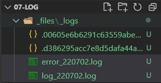
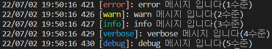

# 로그
프로그램의 상태를 관찰할 수 있도록 프로그램이 제공하는 정보로서 대부분 텍스트 파일 형태로 존재한다.

## 01. winston
1. node.js에서 로그를 파일 형태로 기록할 수 있는 기능을 제공하는 패키지이다.
2. 1년 내내 무중단을 원칙으로 하는 백엔드 시스템 특성상 상당히 많은 양의 로그가 생성되고, 모든 로그를 하나의 파일에 기록하게 되면 특정 파일의 용량이 매우 커지게 된다.
3. 이를 방지하기 위해서 대부분의 로그 패키지들은 날짜별로 파일 생성, 지정한 용량보다 내용이 커질 경우 파일 분할 등의 기능을 기본으로 제공한다.
```shell
$ yarn add winston
$ yarn add winston-daily-rotate-file
```

## 02. 로그 수준
1. 프로그램이 겪는 어떤 상황에 대한 심각도를 의미한다.
2. 로그 시스템 자체적으로 수준을 정해 놓거나 개발자가 필요에 따라 수준을 정한다.
3. winston은 개발자가 직접 정하는 형태이다.

### 로그 수준의 예시
1. 숫자가 낮을 수록 상황이 심각하거나 중요도가 높음을 의미한다.
2. 시스템 설정상에서 기록으로 남길 로그 수준을 2라고 지정한 경우 3, 4, 5 수준의 로그는 기록되지 않는다.
3. 대부분 개발과정에서 4 혹은 5로 지정하고 환성 후 실제 서비스로 전화되면서 0이나 1로 변경한다.
|수준|이름|의미
|---|---|---|
|0|error|시스템이 다운될 정도의 심각한 에러가 발생|
|1|warn|에러가 발생한 것은 아니지만 비정상 동작을 감지했을 때의 의미(경고)|
|2|info|프로그램이 동작하는 과정에서 발생하는 주요 정보들을 출력|
|3|verbose|개발자가 남기는 기록|
|4|debug|개발자가 프로그램이 흐름을 추적할 용도로 변수값들을 기록하기 위해 사용|
```js
import {mkdirs} from './helper/FileHelper.js';
import {join, resolve} from 'path';
import winston from 'winston';
import winstonDaily from 'winston-daily-rotate-file';

// 프로젝트 폴더 위치 조회
const __dirname = resolve();        // C:\Users\juae\Desktop\studynote\07-NodeJS\07-Log

/** (1) 환경설정 정보 */
const config = {
    // 로그 파일이 저장될 경로 및 출력 레벨
    log: {
        // 개발자가 필요에 의해 기록하는 정보들을 저장할 파일
        debug: {
            path: join(__dirname, '_files/_logs'),
            level: 'debug'
        },
        // 시스템에 심각한 문제가 발생했을 때의 정보를 저장할 파일
        error: {
            path: join(__dirname, '_files/logs'),
            level: 'error'
        }
    }
};

/** (2) 로그가 저장될 폴더 생성 */
mkdirs(config.log.debug.path);
mkdirs(config.log.error.path);
```

```js
/** 로그가 출력될 형식 지정 */
const {combine, timestamp, printf, splat, simple} = winston.format;

/** (3) winston 객체 만들기 */
const logger = winston.createLogger({
    // 로그의 전반적인 형식
    format: combine(        // combine - 여러 개 출력결과를 결합해주는 함수
        timstamp({
            format: 'YY/MM/DD HH:mm:ss SSS'
        }),
        printf((info) => {
            return `${info.timestamp} [${info.level}]: ${info.message}`;
        }),
        splat()
    ),
    // 일반 로그 규칙 정의
    transports: [
        // 하루에 하나씩 파일 형태로 기록하기 위한 설정
        new winstonDaily({
            name: 'debug-file',
            level: config.log.debug.level,      // 출력할 로그의 수준
            datePattern: 'YYMMDD',              // 파일 이름에 표시될 날짜형식
            dirname: config.log.debug.path,     // 파일이 저장될 위치
            filename: 'log_%DATE%.log',         // 파일이름 형식. %DATE%는 datePattern의 값
            maxsize: 50000000,
            maxFiles: 50,
            zippedArchive:true
        }),

        // 에러 내용만 기록할 별도의 설정
        new winstonDaily({
            name: 'error-file',
            level: config.log.error.level,
            datePattern: 'YYMMDD',              // 날짜형식
            dirname: config.log.error.path,
            filename: 'error_%DATE%.log',
            maxsize: 50000000,
            maxFiles: 50,
            zippedArchive: true
        })
    ]
});


/** (4) 콘솔 설정 */
// 프로덕션 버전(=상용화 버전)이 아니라면?
if(process.env.NODE_ENV !== 'production'){
    logger.add(
        new winston.transports.Console({
            prettyPrint: true,
            showLevel: true,
            level: config.log.debug.level,
            format: combine(
                winston.format.colorize(),
                printf((info) => {
                    return `${info.timestamp} [${info.level}]: ${info.message}`;
                })
            )
        })
    )
}

logger.error('error 메시지 입니다(1수준)');
logger.warn('warn 메시지 입니다(2수준)');
logger.info('info 메시지 입니다(3수준)');
logger.verbose('verbose 메시지 입니다(4수준)');
logger.debug('debug 메시지 입니다(5수준)');
```


---
## 03. 환경설정을 이용한 방법
1. 프로그램이 구동하는데 필요한 정보들을 별도의 파일에 명시해 놓고, 그 파일의 내용을 읽어들여 변수화 하는 기법
2. 주로 보안이 필요한 내용을 별도 파일에 작성한 후 프로젝트 root 이외의 경로에 별도로 보관하는 형태로 활용한다.

### dotenv 패키지
- node.js로 하여금 시스템 환경변수나 외부 파일에 명시된 설정값들을 로드할 수 있게 하는 패키지
- 설정파일은 일반적으로 `*.env`확장자를 사용한다.
```shell
$ yarn add dotenv
```
<br />

### 설정값 로드
```js
import dotenv from 'dotenv';
dotenv.config({path: 설정파일경로});
console.log(process.env.설정변수이름)
```

#### LogHelper.js
```js
import {join, resolve} from 'path';
import { mkdirs } from './FileHelper.js';
import winston from 'winston';
import winstonDaily from 'winston-daily-rotate-file';
import dotenv from 'dotenv';

/** 설정파일 내용 가져오기 */
dotenv.config({path: join(resolve(), "../config.env")})

/** 로그가 저장될 폴더 생성 */
mkdirs(process.env.LOG_PATH);

const {combine, timestamp, printf, splat, simple} = winston.format;

const logger = winston.createLogger({
    format: combine(
        timestamp({
            format: 'YY/MM/DD HH:mm:ss SSS'
        }),
        printf((info)=>{
            return `${info.timestamp} [${info.level}]: ${info.message}`;
        }),
        splat()
    ),
    transports: [
        new winstonDaily({
            name: 'log',
            level: process.env.LOG_LEVEL,  // 출력할 로그의 수준
            datePattern: 'YYMMDD',
            dirname: process.env.LOG_PATH,  //파일이 저장될 위치
            filename: 'log_%DATE%.log',
            maxSize:50000000,
            maxFiles: 50,
            zippedArchive: true
        }),
    ]
});

if(process.env.NODE_ENV !== 'production'){
    logger.add(
        new winston.transports.Console({
            prettyPrint: true,
            showLevel: true,
            level: process.env.LOG_LEVEL,       // 설정파일
            format: combine(
                winston.format.colorize(),
                printf((info)=>{
                    return `${info.timestamp} [${info.level}]: ${info.message}`;
                })
            ),
        })
    );
}

export default logger;
```
#### 02-winston_real.js
```js
import logger from "./helper/LogHelper.js";

logger.error('error 메세지 입니다.');
logger.warn('warn 메세지 입니다.');
logger.info('info 메세지 입니다.');
logger.debug('debug 메세지 입니다.');
logger.verbose('verbose 메세지 입니다.');
console.log("Hello World");
```